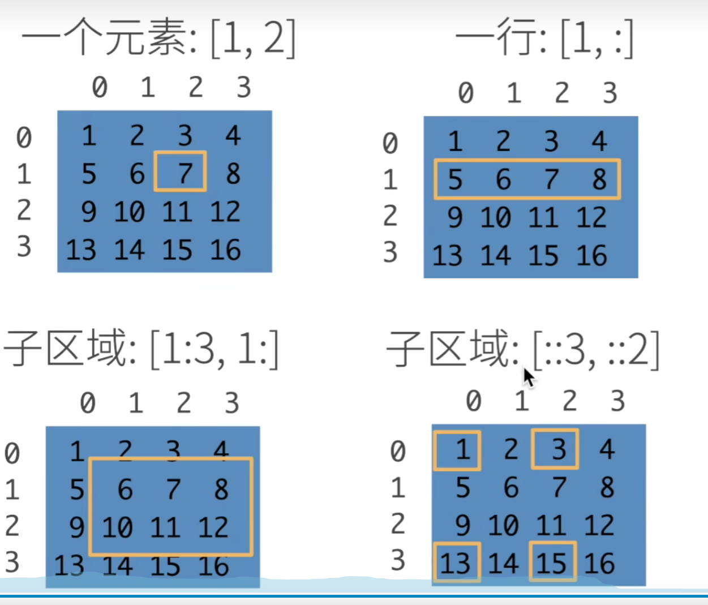
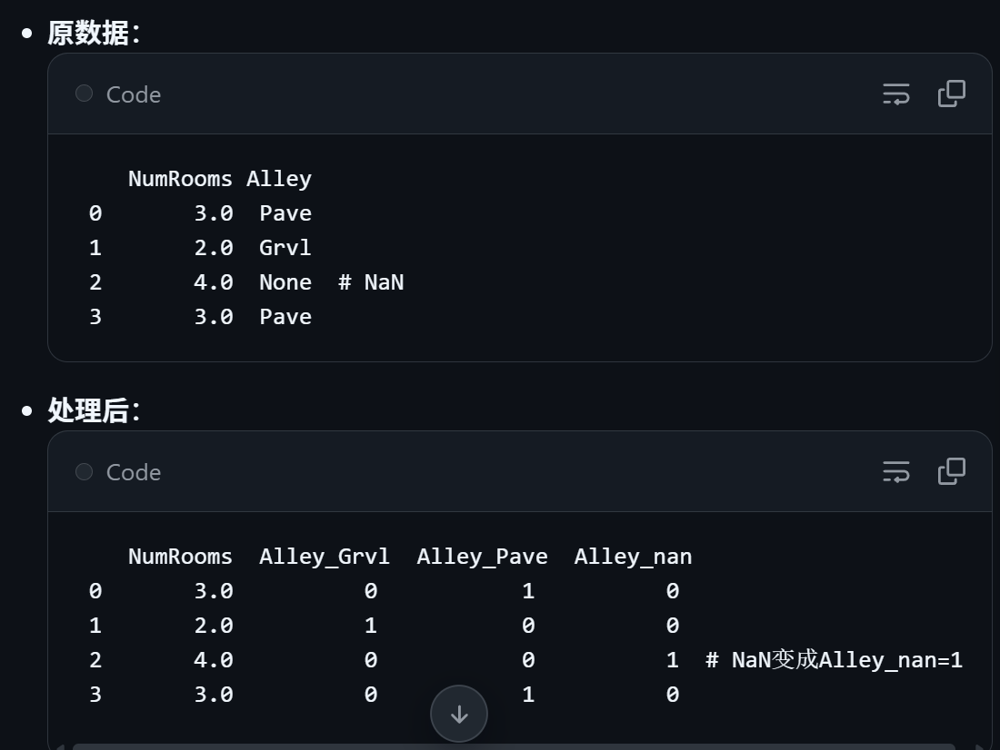

---
---

# 04数据操作

## 04数据操作  

* 切片规则



**行的索引和列的索引都是从零开始的。而且左闭右开，start:end有start无end 如1:3那么就是1和2，如果是[1:3,1:]后面表示列的索引是从1包含1到最后，此时不考虑有start无end**

**同理带步长的切片[start:end:step] ::3意思start和end都省略了，表示从0行到最后一行，每隔3行取一个，因此[::3,::2]等价于从0行到最后一行。从0列到最后一列，步长分别为3和2，也就是取0行、第3行、第0列、第2列**


## 注意顺序是（C,H,W）第一个是layers，也就是通道再* 长度*宽度


* 注意是有（）括号 同时也有两个[[1,2,3],[3,4,9],[2,9,3]]用来表示 **二维矩阵**


# 理解拼接的概念 torch.cat((x,y),dim=0)可想象为行拼接  
# 也就是 【2,1,2,3】
 -------下面接着拼接就是dim=0----------
# 这里就是【2,4,5,3】 egs below  
* 1  2  3     <-- A 的第一行
* 4  5  6     <-- A 的第二行
* 7  8  9     <-- B 的第一行
* 10 11 12    <-- B 的第二行

# 同理dim=1意思为列方向的拼接
* 1 2  3 || 07   08   09     <-- A 的第一行 + B 的第一行
* 4  5  6 || 10 11 12    <-- A 的第二行 + B 的第二行


**省内存的写法，原地操作**
z[:]=x+y   或者 x+=y
因为普通的赋值y-y+x会占用新的内存

# 
翻译官 numpy与tensor 以及 ‘ . ’ 是什么意思
 ‘ . ’的意思就好比技能
  史蒂夫.血量   史蒂夫.攻击力
import torch
x = torch.tensor([1,2,3]) <--这是一个张量

**但是很多时候都只认识numpy的数组 因而需要转化 没办法直接输出、画图等 因为tensor的帽子有一堆没用的**
* 用x的numpy技能 也就是 * n=x.numpy()来解决！

# .item的重要用法---“拆快递”
PyTorch为了能自动求导，哪怕只是一个数字5，也会把它装Tensor的盒里
### 张量 vs 纯数字的直观类比
| 形式 | 含义 | 形象理解 |
|------|------|----------|
| `tensor(5)` | PyTorch 张量对象 | 📦 这是一个**盒子**，盒子里装了数字 5（包含额外的张量属性：数据类型、设备、梯度等） |
| `5` | Python 原生数字 | 🔢 这是数字 5 **本身**（仅表示数值，无额外属性） |

#### 补充说明
- 张量 `tensor(5)` 就像带标签的快递盒：除了里面的“物品（数值5）”，还有“快递单（属性）”（比如 `dtype=torch.int64`、`device=cpu` 等）；
- 纯数字 `5` 就像裸的物品：只有数值本身，没有任何附加信息。

* 直接接loss = torch.tensor（3.5）是不对的！ 因为还有其他的一堆信息

## 那么如果需要打印loss 就只有用技能.item（）
- print(loss.item()) 而并不是用print（loss）

## torch.tensor() 穿上pytorch能用的张量
- import numpy as np  

- data= [1,2,3]
- print(x)
* #输出: tensor([1, 2, 3])*


---

# 04数据预处理

## 从创建的CSV文件中加载原始数据集


### 代码行：inputs, outputs = [data.iloc[:, 0:2], data.iloc[:, 2]]
- data.iloc[:, 0:2]：
  - iloc：按位置索引（像 Excel 行号列号）。
  - :：所有行。
  - 0:2：列 0 和 1（第一列和第二列）。
  - 结果：前两列（NumRooms 和 Alley）作为 inputs（输入特征）。
- data.iloc[:, 2]：
  - 列 2（Price）作为 outputs（输出标签）。
- 整体：把数据分成输入（特征）和输出（目标）。

### 数据填充：mean() 与 fillna() 用法说明
## 1. inputs.mean() 计算均值
- **作用**：对 `inputs` 数据的前两列计算平均值
- **数值列（如 NumRooms）**：
  - 可以正常计算平均值（例如结果为 3.0）
  - 示例：`inputs['NumRooms'].mean()` → 3.0
- **字符串列（如 Alley）**：
  - 计算平均值无实际意义，会返回 NaN（空值）
  - 示例：`inputs['Alley'].mean()` → NaN

## 2. fillna(...) 填充空值
- **全称**：fill NA（填充空值）
- **核心逻辑**：使用计算得到的平均值，填充对应列中的空值
- **完整示例代码**：
```python
import pandas as pd

# 构造示例数据
data = {
    'NumRooms': [3, 2, None, 4, 3],  # 数值列，包含空值
    'Alley': ['Pave', None, 'Grvl', None, 'Pave']  # 字符串列，包含空值
}
inputs = pd.DataFrame(data)

# 计算前两列的均值（仅数值列有效）
mean_values = inputs.mean()
print("各列均值：")
print(mean_values)

# 用均值填充空值（仅数值列会被填充，字符串列仍为 NaN）
inputs_filled = inputs.fillna(mean_values)
print("\n填充空值后的数据：")
print(inputs_filled)

# get_dummies
# （注：这是 pandas 库中的一个函数，用于将分类变量转换为哑变量/指示变量，通常保留原名）
inputs = pd.get_dummies(inputs,dummy_na=True)


## 必须懂： “分类变量必须数字化才能进模型，且不能引入虚假的大小关系，所以要用 One-Hot。” —— 这个逻辑是 AI 没法替你决策的。
One-Hot 的意思就是：给每一个类别都单独开一个开关。

原本的一列 水果，变成了三列开关：

是苹果吗？ (1/0)

是香蕉吗？ (1/0)

是梨吗？ (1/0)

这样一来：

苹果就是 [1, 0, 0]

香蕉就是 [0, 1, 0]

梨就是 [0, 0, 1]

这解决了什么问题？
大家都是平等的！没有谁比谁大，也没有谁加谁等于谁。它们之间的距离都是一样的。

回到你李沐大神那张图：

Alley（小巷路面类型）里有 Pave（铺路）和 Grvl（碎石）。

如果你用 1 和 2 代表它们，模型会以为碎石路是铺路的两倍强（或者反过来）。

所以必须拆开： Alley_Pave 一列，Alley_Grvl 一列。

那个 NaN（空值）： 李沐觉得“没有路”也是一种特征，所以也给它开了一个开关 Alley_nan。

* import torch
* X, y = torch.tensor(inputs.values), torch.tensor(outputs.values)
* X, y
# Pandas → PyTorch Tensor 转换：核心逻辑与细节拆解
## 1. 为什么要做这个转换？（核心逻辑）
- **Pandas (inputs, outputs)**：给**人**看的格式
  - 有表头（如 "NumRooms"）、行号（Index），像 Excel 表格，方便我们检查、清洗数据。
- **PyTorch Tensor (X, y)**：给**模型**“吃”的格式
  - 神经网络不认识“NumRooms”这类文字，只认识纯数字矩阵。
  - 类比：不能把写满字的《食谱》直接煮，要把食谱里的「原材料（数字）」拿出来才可以。

## 2. 代码细节拆解
### ① inputs.values 是什么？
- `inputs`：带表头、行号的 Pandas 表格（有“包装”）；
- `.values`：撕掉表头、行号，只保留裸露的纯数字（去掉包装纸，只剩“肉”）。

### ② torch.tensor(...) 是什么？
- PyTorch 的“专用包装袋”：把裸露的数字封装成 Tensor（张量）格式；
- 核心作用：只有 Tensor 格式，显卡（GPU）才能对数据进行高速计算。

## 3. 转换结果：X 和 y（对应可视化结果）
### X（大写）：特征矩阵（模型的“题目”）
- 对应 `get_dummies` 处理后的数字表格，是多行多列的矩阵；
- 示例：
```python
tensor([[3., 1., 0.],  # 第一间房：3个房间，Pave=1(铺路), Nan=0(非空)
        [2., 0., 1.],  # 第二间房：2个房间，Pave=0, Nan=1（假设仅保留这两列）
        ...])


---

# 050607线代 求导 反向传播 点乘

---

## 1. `requires_grad`：是否追踪梯度（Autograd 开关）

在 PyTorch 中，`requires_grad` 是 Tensor 的核心属性，用来标记**是否需要对该张量计算梯度**。

### 1.1 开启梯度追踪：`requires_grad=True`

- 当 `requires_grad=True` 时，PyTorch 会在**前向传播**中记录该张量参与的运算，构建**计算图（computation graph）**。
- 之后调用 `backward()` 时，能够沿计算图自动求导，得到梯度。

示例：

```python
import torch

a = torch.randn((), requires_grad=True)
d = a * a + 1
d.backward()
print(a.grad)  # dd/da
```

### 1.2 关闭梯度追踪：`requires_grad=False`（默认）

- 不记录计算图，也不计算梯度，节省内存与计算。
- 常用于：输入数据、固定参数、推理阶段等。

---

## 2. `.backward()` / `.grad` / `zero_()`：Autograd 三个基本动作

### 2.1 `x.grad.zero_()`：清空梯度（防止梯度累加）

PyTorch 默认会**累加**梯度：如果不清零，下一次 `backward()` 得到的梯度会加到旧梯度上。

```python
x.grad.zero_()
```

训练中更常见的是：

```python
optimizer.zero_grad()
```

### 2.2 `y.backward()`：反向传播计算梯度

- `backward()` 会沿计算图反向传播，计算所有 `requires_grad=True` 的叶子张量的梯度。
- 结果一般存放在对应张量的 `.grad` 中。

### 2.3 `x.grad`：查看梯度

- `.grad` 的形状通常与 `x` 的形状一致（“梯度形状 = 参数形状”）。

---

## 3. “非标量怎么求导”：`sum()`（或 `mean()`）把输出变成标量

PyTorch 中最常用的方式是：**把向量/矩阵输出先聚合成标量**再反传。

### 3.1 `sum()` 求导示例：`y = x.sum()`

```python
import torch

x = torch.arange(4.0, requires_grad=True)  # tensor([0.,1.,2.,3.])
y = x.sum()                                # 标量
y.backward()
print(x.grad)  # tensor([1., 1., 1., 1.])
```

### 3.2 “求导的求和技巧”：`y = x*x` 但用 `y.sum().backward()`

```python
x = torch.arange(4.0, requires_grad=True)
x.grad.zero_()

y = x * x                 # tensor([0.,1.,4.,9.])  (非标量)
y.sum().backward()        # 关键：先 sum 成标量再 backward
print(x.grad)             # tensor([0., 2., 4., 6.])  -> 2x
```

---

## 4. `detach()`：把某些计算“移到计算图之外”（切断梯度流）

### 4.1 核心含义

`u = y.detach()` 的意思：

- `u` **拿到 `y` 当前的数值**；
- 但 `u` **不再连接到产生 `y` 的计算图**；
- 因此从 `u` 出发的后续计算，梯度不会回传到 `y` 的来源（链式法则在此断开）。

### 4.2 为什么用了 `detach()` 结果会变？

对比两种情况（非常常见的 D2L 讲法）：

#### 情况 A：使用 `detach()`

```python
x = torch.arange(4.0, requires_grad=True)
x.grad.zero_()

y = x * x          # y 与 x 有计算图关系
u = y.detach()     # u 与 y 断开：u 被当作常量（对 x 不再可导）
z = u * x          # z = (常量u) * x

z.sum().backward()
print("x.grad =", x.grad)
print("u      =", u)
```

- 因为 `u` 被视作常量，`z = u*x` 对 `x` 的导数就是 `u`（逐元素）。

#### 情况 B：不使用 `detach()`

```python
x = torch.arange(4.0, requires_grad=True)
x.grad.zero_()

y = x * x
z = y * x          # z = x^2 * x = x^3

z.sum().backward()
print(x.grad)      # 逐元素应为 3*x^2
```

### 4.3 典型用途（D2L 常见语境）

- 固定某一部分计算/参数，不希望梯度更新它；
- 只想用某个中间结果的“当前值”，但不想让梯度穿过该分支。

---

## 5. `sum(axis/dim=...)` 的维度变化 + `keepdims/keepdim` 的作用

这部分是 D2L 里非常核心的“维度直觉”。

### 5.1 二维张量：`(5,4)` 的例子

假设 `A.shape = (5,4)`：

- `A.sum(axis=0)`：对 **列** 求和（沿行方向累加），结果形状通常是 `(4,)`
- `A.sum(axis=1)`：对 **行** 求和（沿列方向累加），结果形状通常是 `(5,)`

在 PyTorch 中写法通常是：

- `A.sum(dim=0)` 或 `A.sum(dim=1)`

### 5.2 `keepdims/keepdim`：求和后是否保留被压缩的维度

- 默认 `keepdim=False`：被求和的那一维会**消失**。
- 若 `keepdim=True`：那一维会保留为长度为 1 的维度，方便后续广播对齐。

例：`A.shape = (5,4)`

- `A.sum(dim=1)` -> shape `(5,)`
- `A.sum(dim=1, keepdim=True)` -> shape `(5,1)`

---

## 6. 广播（Broadcasting）与“行归一化”：为什么常常需要 `keepdim=True`

### 6.1 正确的逐行归一化写法

目标：每一行除以该行的和，使每行元素和为 1。

```python
import torch

A = torch.tensor([[1., 3.],
                  [2., 4.]])

sum_A = A.sum(dim=1, keepdim=True)   # shape (2,1), 值 [[4],[6]]
normalized = A / sum_A

print(sum_A)
print(normalized)
```

输出应类似：

- `sum_A = [[4.],[6.]]`
- `normalized = [[0.25, 0.75], [0.3333, 0.6667]]`（每行和为 1）

### 6.2 不用 `keepdim=True` 可能产生“错位广播”

```python
sum_A_bad = A.sum(dim=1)   # shape (2,) -> [4,6]
normalized_bad = A / sum_A_bad
print(normalized_bad)
```

这种写法会触发广播，但广播对齐方式可能导致结果**不是逐行除以本行和**（容易出现错位/逻辑错误），因此做“按行/按列归一化”时，D2L 强烈建议用 `keepdim=True` 保持维度对齐。

---

## 7. 三维张量的 `sum`：`shape = (2,5,4)` 时 `axis/dim` 怎么理解

设 `a = torch.ones((2,5,4))`：

```python
import torch
a = torch.ones((2,5,4))
print(a.shape)                 # torch.Size([2, 5, 4])

b = a.sum(dim=1)
print(b.shape)                 # torch.Size([2, 4])
print(b)                       # 每个元素为 5（因为 dim=1 那一维长度是 5）
```

- `sum(dim=1)`：把中间那一维（长度 5）求和掉，所以从 `(2,5,4)` 变成 `(2,4)`
- 若 `keepdim=True`：
  - `a.sum(dim=1, keepdim=True)` 形状为 `(2,1,4)`
- 多维一起求和（概念上与 D2L 一致）：
  - `a.sum(dim=(1,2), keepdim=True)` 形状为 `(2,1,1)`

---

## 8. `cumsum`：沿某个轴计算“累积和”（cumulative sum）

`cumsum` 会从起点开始，把当前元素与之前元素不断累加。

### 8.1 `axis/dim=0` 的含义

- `dim=0`：沿“行”方向累积（对每一列分别做从上到下的累加）。

示例（5×4）：

```python
import torch
A = torch.arange(20.0).reshape(5,4)
print(A)

C = A.cumsum(dim=0)
print(C)
```

直观理解（按列累加）：

- 第 1 行：不变
- 第 2 行：第1行 + 第2行
- 第 3 行：前两行累计 + 第3行
- ...
- 最后一行：就是该列的总累积结果

---

## 9. 行向量 vs 列向量：以及 `torch.mv` 的“向量隐形处理”

### 9.1 行/列向量概念

- 行向量：形状 `1×n`
- 列向量：形状 `n×1`
- 一维张量 `x.shape == (n,)` 在不同算子里可能有约定处理。

### 9.2 `torch.mv(A, x)`：矩阵 × 向量

- `torch.mv` 专门用于 **(m×n) 矩阵** 乘 **(n,) 向量**。
- 你看到 `x.shape=(n,)` 虽是 1D，但在 `mv` 语义里会按“向量”规则处理，使维度匹配 `A @ x`。

示例：

```python
import torch

A = torch.randn(5,4)
x = torch.randn(4)          # shape (4,)
b = torch.mv(A, x)          # shape (5,)
print(b.shape)
```

---

## 10. `torch.mm(A, B)`：矩阵 × 矩阵（2D × 2D）

`torch.mm` 是 **矩阵乘法**（matrix-matrix multiply）：

- 输入必须都是 2D
- 维度规则：`A(m×n) @ B(n×p) -> C(m×p)`

示例：

```python
import torch

A = torch.arange(20.0).reshape(5,4)   # 5×4
B = torch.ones(4,3)                   # 4×3
C = torch.mm(A, B)                    # 5×3
print(C.shape)
print(C)
```

如果 `B` 每列都是全 1，则 `C` 的每个元素是“对应行元素之和”（并在每列重复）。

---

## 11. 建议练习（与截图一致）：把 `x.sum()` 升级为 `(x*x).sum()`

目的：亲手验证梯度从 `1` 变成 `2x`。

```python
import torch

x = torch.arange(4.0, requires_grad=True)
if x.grad is not None:
    x.grad.zero_()

y = (x * x).sum()
y.backward()
print(x)
print(x.grad)   # 应为 2*x
```

---

## 12. 本章（对应 D2L 语境）你需要真正“吃透”的东西（不靠背公式）

- 会用：`requires_grad=True`
- 会用：`backward()`
- 记得：梯度会累加 -> 每轮先 `zero_grad()` / `grad.zero_()`
- 非标量输出：常用 `sum()` / `mean()` 变标量再反传
- 需要“断梯度”：`detach()`
- 维度/广播：`sum(dim=..., keepdim=True)` 是很多归一化/广播正确性的关键
- 线代接口区分：`mv`（矩阵×向量） vs `mm`（矩阵×矩阵）

```

```


---

# 08线性回归从零开始


---

# 08线性回归简洁实现

# 线性回归的简洁实现


## 理解features 和labels 【非常重要】
 - features（特征）：它就是一个 Excel 表格。里面有 1000 行、2 列。你可以把它当成 1000 个机器人的 “身高”和“体宽”。

 - labels（标签）：它也是一个 Excel 表格。里面有 1000 行、1 列。这是这 1000 个机器人对应的 “真实体重”（标准答案）。

 注意！！因为在我们的任务里，身高和体宽是“已知条件”（线索），而体重是我们要猜的“未知结果”（目标）。你想象一下你在做一道数学应用题：题目（已知线索）：小明买了 2 斤苹果，每斤 5 块钱。（这是 2 个特征参数，相当于 2 列）。问题（未知结果）：请问小明一共花了多少钱？
答案（标签）：10 块钱。（这是 1 个最终结果，相当于 1 列）。你看，2 个线索，推导出 1 个答案，这完全没毛病对吧？ 你不需要让 AI 去猜“苹果几斤、几块钱”，因为这些是你喂给它的前提条件！在你的机器人例子里，你用尺子量出了它的身高和体宽（2个特征），你想让 AI 帮你算出它的重量（1个标签）。多因一果，这就是为什么特征有 2 列，而标签只有 1 列

 ## 既然列数不一样，它们到底是怎么“对应”上的？
PyTorch 的“订书机”机制（TensorDataset），根本不看你有几列，它只看你有几行！

它是按“行（第几个机器人）”来一一对应的：

第 1 行对应：

左手边（特征箱子抽出第 1 行）：[180厘米, 50厘米]  👉 这是 1号机器人 的线索。

右手边（标签箱子抽出第 1 行）：[100公斤] 👉 这是 1号机器人 的真实重量答案。

咔嚓！钉在一起！ AI 拿到这张卡片就懂了：“哦，原来 180 高、50 宽的家伙，重 100 公斤啊！”

第 2 行对应：

左手边（特征箱子抽出第 2 行）：[160厘米, 40厘米] 👉 这是 2号机器人 的线索。

右手边（标签箱子抽出第 2 行）：[70公斤] 👉 这是 2号机器人 的真实重量答案。

咔嚓！钉在一起！

发现了吗？特征的列数可以无限多！
哪怕你以后收集了机器人的 身高、体宽、材质、电池容量、电机型号（5 列特征），但你要预测的依然只是它的重量（1 列标签）。订书机依然是把“1号机器人的 5 个特征”和“1号机器人的 1 个重量”钉在一起。

## 读取数据集 [非常重要]


自然的逻辑：在现实中，零件（features）和重量说明书（labels）是分开的两个大箱子。如果直接丢进机器，第 1 个零件可能会配上第 500 个说明书，彻底乱套！

TensorDataset 在干嘛：它就像一个订书机。它会把第 1 个零件和第 1 个说明书死死钉在一起，做成一张“卡片”。钉完之后，我们就得到了 1000 张绝对不会错乱的“带答案的识字卡”。

# 神经网络的预参数设定


如果我现在让你处理一个新任务——“收集了机器人的 5 个传感器数据（5个特征），要预测它的 3 个关节角度（3个输出标签）”。你能一秒钟反应过来，代码要改成 
- net = nn.Sequential(nn.Linear(5, 3))


*nn.Sequential(...)：这是一个“流水线传送带”*
虽然现在我们的模型极其简单，只包含 Linear 这一台机器，
 - 外层 nn.Sequential(...)——流水线/传送带

Sequential 的作用是把多个层串成一条线

但是由于以后几乎所有的深度学习模型都是多层的，在这里使用 Sequential 会让你提前熟悉“标准的流水线”操作。以后你要加机器，只需要往里面用逗号隔开一直塞就行了
- nn.Sequential(机器A, 机器B, 机器C)。

 ## 初始化模型参数 [看懂即可]


既然 nn.Linear 已经在肚子里偷偷建好了旋钮 $w$（权重）和 $b$（偏置），那在我们通电开机之前，总得给它们一个初始的位置吧？net[0]：就是指代我们流水线上的第 1 台机器（也就是那个 Linear 层）。编程里计数是从 0 开始的。weight.data.normal_(0, 0.01)：我们通过 .weight.data 访问到这台机器的权重旋钮，然后用替换方法 normal_ 把它的初始值设定为一个从均值为 0、标准差为 0.01 的正态分布中随机采样出来的小数。bias.data.fill_(0)：我们通过 .bias.data 访问偏置旋钮，用替换方法 fill_ 把偏置参数初始化为零。


人话翻译：MSE 是 Mean Squared Error（均方误差）的缩写。这就相当于你在车间里挂了一个“全自动计分板”。它干了什么？ 它完美替代了上一节课里那个丑陋的 (y_hat - y.reshape(y_hat.shape))**2 / 2。默认情况下，它会自动把所有样本的损失加起来，然后算出一个平均值返回给你。计算均方误差使用的就是这个 MSELoss 类，数学上也叫它平方$L_2$范数。掌握到什么水平？ 死死记住！ 以后只要你是做“预测具体数值”的任务（比如预测机器人的重量、预测电机的温度），闭着眼睛写这行代码就对了。

-------------------------------------------------- 

net.parameters()：这是你把模型（net）里所有的旋钮（权重 $w$ 和偏置 $b$）一把抓过来，全部交给了这位纠错大师。大师拿到了控制权，一会儿才知道该去拧谁。lr=0.03：lr 是 Learning Rate（学习率）。这是你给大师定的规矩：每次拧旋钮的时候，步子（幅度）迈多大。小批量随机梯度下降只需要设置这一个 lr 值即可。它替代了什么？ 它完美替代了上一节课你大呼熟悉的那个鱼书核心公式：param -= lr * param.grad / batch_size。PyTorch 在 optim 模块中实现了这种算法的标准工具和许多变种。

# 一定要背下来的用于【训练的代码】


##　⭐⭐⭐⭐一句话记忆：在 PyTorch 里，模型对象加括号 = 执行前向传播　－－－》动作１　

- 先搞清楚"前向传播"这四个字
- "前向"就是从左往右、从输入到输出，数据像水流一样单向流过整台机器。
  
### `net(X)` 计算过程
`net(X)` 的计算仅包含以下步骤：

#### 1. 计算公式
$$
\hat{y} = x_1 \times w_1 + x_2 \times w_2 + b
$$

#### 2. 代入数值
$$
\hat{y} = 0.5 \times 0.0032 + (-1.0) \times (-0.0015) + 0
$$

#### 3. 计算结果
$$
\hat{y} = 0.0016 + 0.0015 + 0 = 0.0031
$$


输入 X ──→ 【机器内部计算】──→ 输出 ŷ（预测值）
而且当有10个样本，也就是一个 batch 的时候，net x 会同时算10个预测值，也就是矩阵的运算
---

# PyTorch 自动求导

PyTorch 会自动计算损失函数 $l$ 对参数的偏导数：

- 对权重 $w_1$ 的偏导数：
$$
\frac{\partial l}{\partial w_1}
$$

- 对权重 $w_2$ 的偏导数：
$$
\frac{\partial l}{\partial w_2}
$$

- 对偏置 $b$ 的偏导数：
$$
\frac{\partial l}{\partial b}
$$

计算出的梯度会自动保存在对应参数的 `.grad` 属性中。

-----------

loss(net(X), y) 完整链条
现在把前向传播和损失函数串起来：

l = loss(net(X), y)

Python 的执行顺序是从内到外，所以拆成两步：

第①步：先算 net(X)     → 得到 ŷ（10个预测值）
第②步：再算 loss(ŷ, y) → 得到 l（一个损失数字）

# ⭐⭐⭐⭐四行核心训练代码详解
## 第1行：为什么要赋值给 l？
```python
l = loss(net(X), y)
```
先想一个问题：如果不存下来会怎样？
```python
loss(net(X), y)         # 算完就扔了，没人记住这个结果
```
下一行你需要对它做 `.backward()`，但你找不到它了，因为你没给它起名字！

### 类比
```python
# 你去超市买东西
价格 = 收银台.扫码(苹果)    # 把价格存到变量里
print(价格)                 # 后面还能用

# 如果你不存：
收银台.扫码(苹果)           # 扫完了，价格显示了一下就消失了
print(???)                  # 你想查价格？没了，找不到了
```
所以 `l` 就是一个名字，用来"记住"这次算出来的损失值，方便后面用它做反向传播。

`l` 是 loss 的首字母缩写，你叫它 abc 也行，只是习惯用 l。

---

## 第3行（先讲这行）：为什么用 l 做反向传播？
```python
l.backward()
```
`l` 不只是一个数字！
你以为 `l` 就是一个普通的数字比如 0.35？不是！

`l` 是一个带着"记忆"的特殊张量。它记住了自己是怎么算出来的：

#### l 的记忆链条：
```
l ← 是由 loss 函数算出来的
  ← loss 的输入是 net(X) 和 y
    ← net(X) 是用 w 和 b 算出来的
      ← w 和 b 是模型的参数
```
PyTorch 在前向传播的时候，偷偷帮你画了一张图：
```
w ──┐
    ├──→ net(X) ──→ ŷ ──┐
b ──┘                    ├──→ loss ──→ l
                    y ───┘
```
当你调用 `l.backward()` 时，PyTorch 就沿着这张图，从右往左倒着走：
```
l ──→ 算出 ∂l/∂ŷ ──→ 算出 ∂l/∂w 和 ∂l/∂b
```
它算出的就是：

"如果我把 $w_1$ 调大一点点，$l$ 会变大还是变小？"
"如果我把 $w_2$ 调大一点点，$l$ 会变大还是变小？"
"如果我把 $b$ 调大一点点，$l$ 会变大还是变小？"

这些答案（梯度）被存在：
```python
net[0].weight.grad   # w的梯度，存在这里
net[0].bias.grad     # b的梯度，存在这里
```

---

## 第2行：zero_grad() 为什么要清空梯度？
```python
trainer.zero_grad()
```
### 先看一个灾难场景
假设不清零：
```
第1批数据：backward() → w的梯度 = 0.5
第2批数据：backward() → w的梯度 = 0.5 + 0.3 = 0.8  ← 累加了！
第3批数据：backward() → w的梯度 = 0.8 + 0.2 = 1.0  ← 又累加了！
```
PyTorch 的默认行为是：新梯度会叠加到旧梯度上面！

这是 PyTorch 故意设计的（某些高级场景需要累加），但对我们来说是灾难——我们每批数据应该独立算梯度。

### 加上清零之后
```
第1批数据：zero_grad() → 梯度=0 → backward() → 梯度=0.5  ✓ 干净的
第2批数据：zero_grad() → 梯度=0 → backward() → 梯度=0.3  ✓ 干净的
第3批数据：zero_grad() → 梯度=0 → backward() → 梯度=0.2  ✓ 干净的
```

### 类比
```
你用计算器：
  算第1题：3+5=8     ← 对的
  算第2题：没按清零，直接按 +2×3=14   ← 错了！8还留着呢！

正确做法：
  算第1题：3+5=8
  按 AC（清零）
  算第2题：2×3=6     ← 对了
```
`trainer.zero_grad()` 就是按计算器的 AC 键。

---

## 第4行：trainer.step() 从哪来的？干什么的？
```python
trainer.step()
```
### 它从哪来？
往上翻，你定义过这行：
```python
trainer = torch.optim.SGD(net.parameters(), lr=0.03)
```
`trainer` 就是你在这行创建的优化器对象，它是 SGD（随机梯度下降）。

就像 `net` 可以加括号调用一样，`trainer` 也有自己的方法，其中最重要的就是 `.step()`。

### 它干什么？
`.step() = 真正动手改参数！`

前面所有步骤都是"分析"，只有 step() 是"动手"：
```python
# step() 内部做的事情（简化版）：
w = w - lr × w的梯度
b = b - lr × b的梯度
```

### 用具体数字：
```
假设当前：
  w₁ = 0.5
  w₁的梯度 = 2.0
  lr = 0.03

执行 step() 后：
  w₁ = 0.5 - 0.03 × 2.0 = 0.5 - 0.06 = 0.44
```
参数被"拧"了一下，朝着让损失变小的方向调整了。

### 类比
```
你考试考了60分（l = 损失很大）

l.backward()  → 分析原因：数学太差（梯度告诉你方向）
trainer.step() → 真正行动：回家刷数学题（更新参数）

下次考试考了70分（l 变小了）
```
`backward()` 是军师出谋划策，`step()` 是将军带兵冲锋。

---

## 四行代码的完整故事
```python
# 场景：发牌机给了10道题（X和y）

l = loss(net(X), y)     # ① 做题+批改，得到分数l
trainer.zero_grad()      # ② 把上次的草稿纸擦干净 ！！注意trainer写的是所有的parameters因此都清理干净的
l.backward()             # ③ 分析"哪里做错了，该怎么改"
trainer.step()           # ④ 真正改正：调整 w 和 b
```

### 时间线：
```
─────────────────────────────────────────────→

  ①做题得分   ②擦草稿纸   ③分析错因   ④改正参数
  l=0.35      梯度清零     算梯度      w和b更新
     │                       │            │
     │    前向传播的产物       │  反向传播    │ 参数更新
     └───────────────────────┴────────────┘
              一个batch的完整处理流程
```

### 为什么顺序是 ① → ② → ③ → ④？
| 能不能换顺序？ | 结果 |
|----------------|------|
| ② 和 ① 换？zero_grad() 放在 loss 前面？ | 可以！ 很多人确实这么写，效果一样 |
| ③ 放在 ② 前面？先 backward() 再 zero_grad()？ | 不行！ 你刚算出的梯度会被清掉 |
| ④ 放在 ③ 前面？先 step() 再 backward()？ | 不行！ 还没算梯度你拿什么更新？ |

唯一的硬性要求：② 清零必须在 ③ 算梯度之前，③ 算梯度必须在 ④ 更新之前。

问题一：偏置 $b$ 到底是从哪冒出来的？！你非常敏锐！你发现 nn.Linear(2, 1) 里面明明只写了 2（输入特征）和 1（输出结果），这说明它造了 2 个权重 $w$，那偏置 $b$ 呢？我根本没写啊！答案是：PyTorch 偷偷白送给你了！在 PyTorch 的底层源码里，nn.Linear 这个机器的完整说明书其实长这样：nn.Linear(in_features, out_features, bias=True)看到那个 bias=True 了吗？这是框架的出厂默认设置！框架的创造者知道，全天下 99.99% 的线性模型和神经网络，都必须带偏置 $b$。所以为了让你少打几个字，只要你写 nn.Linear(2, 1)，它在底层就会自动给你生成一个 $2 \times 1$ 的权重矩阵 $w$，同时再悄悄生成一个偏置标量 $b$。如果哪天你真的遇到了一个极其奇葩的任务，坚决不需要 $b$，你必须手动强制关掉它：写成 nn.Linear(2, 1, bias=False)。总结：不是你没设置，而是 PyTorch 把它当成标配，帮你默认开启了！

问题二：net 到底是个啥？为什么可以像函数一样写成 net(X)？你觉得奇怪，net = nn.Sequential(nn.Linear(2, 1)) 明明是一个赋值语句，定义了一个“流水线”对象，怎么到了下面，它摇身一变，就能加上括号当成函数 net(X) 来用了呢？这是 Python 语言和 PyTorch 结合产生的一种**“魔法机制”**：net 是一台物理存在的机器：当你写下 net = nn.Sequential(...) 的时候，你相当于在车间里把这台名叫 net 的机器实体给造出来了。这台机器肚子里装着刚才说的 $w$ 和 $b$。net(X) 相当于按下机器的“启动按钮”：在 PyTorch 里，所有的神经网络模型（也就是 nn.Module 的子类），都被赋予了一个隐藏技能。只要你在机器名字后面加上括号，并且往里面塞入材料 X，机器就会自动启动内部的齿轮，执行前向传播（Forward）。底层到底干了啥？ 当你执行 net(X) 时，PyTorch 在底层其实是在帮你执行：X 乘以 肚子里的 w + 肚子里的 b，然后把算出来的预测值（那个 1 个特征的输出结果）吐给你。大白话：net 是电饭煲，X 是生米。net(X) 的意思就是**“把生米倒进电饭煲，盖上盖子通电，等它煮成熟饭（预测结果）吐出来”**。

问题三：最核心的死结！为什么是 loss(net(X), y)，而不是 loss(net(features), labels)？
这个问题是你走向“工程实战”必须要迈过去的一道超级大坎！我们回到那个“车间主任与发牌机”的故事：

features 和 labels 是什么？ 它们是你车间仓库里存放的 1000 个零件的总集。

发牌机 data_iter 在干嘛？ 你的内存条根本吃不下一次性把 1000 个零件全塞进机器里算。所以发牌机 for X, y in data_iter: 的作用是，每次只去仓库里搬 10 个零件出来！

这里的 X，就是发牌机刚刚发给你的 10 个零件的尺寸。

这里的 y，就是这 10 个零件对应的标准重量。

🚨 灾难预演：如果你写成了 loss(net(features), labels) 会发生什么？

假如你真的这么写了，你的循环就变成了这样：

发牌机给你发了 10 张牌（X 和 y）。

你把这 10 张牌扔到一边看都不看。

你跑到仓库里，把所有的 1000 个 features 强行塞进 net 机器里预测。

你拿这 1000 个预测结果，和 1000 个 labels 去算 Loss 分数


---

# 09softmax初见与损失函数

Softmax 回归（用于分类问题）核心逻辑：

多输出： 模型的输出个数等于类别的个数（预测每个类别的得分）。

Softmax 函数： 负责把模型的得分，转换成加起来等于 1 的概率值。

交叉熵损失（CrossEntropyLoss）： 分类问题专属的计分板，用来计算预测概率和真实答案之间的误差。

# 损失函数可视化：3种“教练”的脾气
### 核心规则（死盯两根线）
- 横坐标（左右）：偏离马路中心的距离 = **你错得有多离谱**（0=完美猜中标准答案）
- 蓝线（Loss）：罚款金额 → 错得越远，罚款越狠
- 橙线（Gradient）：教练拽方向盘的力度 → 模型纠正错误的“力气”
- 绿线忽略！只看蓝+橙！


### 核心记忆点（记死这3句话）
1. L2教练：远猛拽、近轻揉 → 日常常用，但极端错误易“梯度爆炸”（拽断方向盘）
2. L1教练：力度不变 → 抗异常值，但终点画龙（稳不住）
3. Huber教练：聪明缝合怪 → 远稳（像L1）、近柔（像L2）→ 首选！


---

# 09softmax回归简洁实现


# 最重要的一节
 - net = nn.Sequential(nn.Flatten().nn.Liner(784,10))
----------------
 *零件① nn.Flatten()*
 发牌机给你的一张图片形状是：[1, 28, 28]
 - **通道**：1
 - **高**：28
 - **宽**：28

Flatten 之后变成：[784]

计算过程为：$1×28×28 = 784$

也就是把一个 28×28 的方阵“展开”成一条直线 

原来（二维矩阵）：
\
\begin{bmatrix}
0.1 & 0.5 \\
0.3 & 0.9
\end{bmatrix}
\
形状：(2, 2)

拍平后（一维向量）：[0.1, 0.5, 0.3, 0.9]
形状：(4,) -->也就是1,4

这里通过将二维矩阵按顺序逐行展开，得到了一维向量。原本二维的结构被“拍平”，数据元素按顺序排列在一维向量中 。 

-------------

## 为什么要拍平？
   - nn.Linear 只能接收一维的输入（一个向量）
   - 你不能把一个 28×28 的方阵直接塞进 Linear
   - 必须先压成 784 的一维向量，Linear 才认识

⚠️ 当一批有 256 张图片时：

<!-- Flatten 前的表格 -->
<table style="font-family: monospace; border-collapse: collapse; margin: 10px 0;">
  <tr>
    <td style="padding: 0 5px; text-align: right;">Flatten 前：</td>
    <td style="padding: 0 5px; text-align: center;">[256,</td>
    <td style="padding: 0 5px; text-align: center;">1,</td>
    <td style="padding: 0 5px; text-align: center;">28,</td>
    <td style="padding: 0 5px; text-align: center;">28]</td>
  </tr>
  <tr>
    <td style="padding: 0 5px;"></td>
    <td style="padding: 0 5px; text-align: center;">↑</td>
    <td style="padding: 0 5px; text-align: center;">↑</td>
    <td style="padding: 0 5px; text-align: center;">↑</td>
    <td style="padding: 0 5px; text-align: center;">↑</td>
  </tr>
  <tr>
    <td style="padding: 0 5px;"></td>
    <td style="padding: 0 5px; text-align: center;">256张</td>
    <td style="padding: 0 5px; text-align: center;">1通道</td>
    <td style="padding: 0 5px; text-align: center;">28高</td>
    <td style="padding: 0 5px; text-align: center;">28宽</td>
  </tr>
</table>

<!-- Flatten 后的表格 -->
<table style="font-family: monospace; border-collapse: collapse; margin: 10px 0;">
  <tr>
    <td style="padding: 0 5px; text-align: right;">Flatten 后：</td>
    <td style="padding: 0 5px; text-align: center;">[256,</td>
    <td style="padding: 0 5px; text-align: center;">784]</td>
  </tr>
  <tr>
    <td style="padding: 0 5px;"></td>
    <td style="padding: 0 5px; text-align: center;">↑</td>
    <td style="padding: 0 5px; text-align: center;">↑</td>
  </tr>
  <tr>
    <td style="padding: 0 5px;"></td>
    <td style="padding: 0 5px; text-align: center;">256张</td>
    <td style="padding: 0 5px; text-align: center;">每张784个数字</td>
  </tr>
</table>

<p style="font-family: monospace; margin-top: 15px;">
注意！Flatten 只拍平后面的维度<br>
      第0维（256张）保留不动！
</p>

-----------------------
 *零件② nn.Linear(784, 10)*
* 784 → 输入特征数（28×28=784个像素）
* 10  → 输出类别数（10种衣服）

*内部自动创建了*
 ### 权重 w：形状 [10, 784]  → 10×784 = 7840 个参数
 ### 偏置 b：形状 [10]       → 10 个参数
　- 总共 7850 个参数需要训练


## 如果换了别的图片
 - 32×32 彩色图片 → 3 × 32 × 32 = 3072  → nn.Linear(3072, ...)
- 64×64 黑白图片 → 1 × 64 × 64 = 4096  → nn.Linear(4096, ...)
- 28×28 黑白图片 → 1 × 28 × 28 = 784   → nn.Linear(784, ...)

- 公式：第一个数 = 通道数 × 高 × 宽
---------
## 如果换了别的任务
- 分类任务中 nn.Linear 输出维度的核心规则
 * 分类任务的最后一层 `nn.Linear` 第二个参数 = 任务的类别数


## 例子
- 猫狗分类（2类）    → nn.Linear(..., 2)
- 数字识别（10类）   → nn.Linear(..., 10)
- ImageNet（1000类） → nn.Linear(..., 1000)

----------------

零件③ nn.Sequential(...)

- nn.Sequential(nn.Flatten(), nn.Linear(784, 10))
*Sequential 把零件串联起来*
- 这里的两层指的是Sequential()里面有两层
- 分别是Flatten 和 Linear层

  **架构图**


### 如果换了一个数据集
### 彩色图片 32×32，**分100类**
```python
net = nn.Sequential(nn.Flatten(), nn.Linear(3*32*32, 100))
#                                            ↑        ↑
#                                     3072个像素   100个类别
```

### 黑白图片 64×64，**分5类**
```python
net = nn.Sequential(nn.Flatten(), nn.Linear(1*64*64, 5))
#                                            ↑       ↑
#                                     4096个像素   5个类别
```
-------------


--------------------

### `nn.CrossEntropyLoss()` ——为什么必须用它

先理解"分数"和"概率"的区别

**模型输出的是"原始分数"（logits）**：
```python
[2.1, 0.3, -1.5, 0.8, ...]
```
  - 可以是任意数字，正的负的都行
  - 不是概率！（概率必须在0~1之间，且加起来等于1）

**经过 `softmax` 变成"概率"**：
```python
[0.45, 0.07, 0.01, 0.12, ...]
```
  - 每个数在 0~1 之间
  - 全部加起来 = 1.0

**为什么不自己算 `softmax`？**

```python
# ❌ 自己算 softmax 可能出事：

分数 = [100, 200, 300]

exp(100) = 26881171418...（巨大）
exp(200) = 更巨大
exp(300) = 电脑装不下 → 变成 inf → 程序崩溃！
```

```python
# ✅ CrossEntropyLoss 内部用数学技巧避免了这个问题
# 你只需要：

loss = nn.CrossEntropyLoss()
l = loss(原始分数, 真实标签)     # 直接丢原始分数进去！
```
-----------------
## 你的模型最后一层只输出原始分数！
## 不要自己加 softmax！

## ❌ 错误！！！
```python
net = nn.Sequential(
    nn.Flatten(),
    nn.Linear(784, 10),
    nn.Softmax(dim=1)       # ← 多加了这一层
)
```
CrossEntropyLoss 内部还会再算一次 softmax
等于算了两次 softmax → 结果全错

## ✅ 正确！！！
```python
net = nn.Sequential(
    nn.Flatten(),
    nn.Linear(784, 10)      # ← 到这里结束，不加 softmax
)
```

---------------
# 分类任务的固定套路 

## ① 数据
```python
batch_size = 256      # 你选的数字
train_iter, test_iter = d2l.load_data_fashion_mnist(batch_size)
```

## ② 模型
```python
net = nn.Sequential(
    nn.Flatten(),              # 🔒 拍平，必须有
    nn.Linear(784, 10)           # 🔒 Linear不能改
)                #    数字根据数据改
```

## ③ 损失函数
```python
loss = nn.CrossEntrop   # 🔒 分类永远用这个
```
**PS:回归用什么损失函数？
  → nn.MSELoss()**
## ④ 优化器
```python
trainer = torch.optim.SGD(net.parameters(), lr=0.1) # 🔒 SGD不能改
                    #    lr自己调
```

## ⑤ 训练
```python
for epoch in range(10):  # 你选几轮
    for X, y in train_iter:
        l = loss(net(X), y)      # 🔒 这个结构不能变
        trainer.zero_grad()       # 🔒 必须清梯度
        l.backward()              # 🔒 必须反向传播
        trainer.step()            # 🔒 必须更新参数
```


---

# 09数据集加载基本功

### 真实数据变为张量
- 图片本来就是数字
--------------
## 第一步：图片在电脑里根本不是"图"
你在屏幕上看到一张照片，觉得它是一幅画。
但在电脑的存储里，它就是一堆数字！

一张 28×28 的黑白图片，在电脑里长这样：
  0   0   0   0   0   0   0   0   0   0  ...  (第1行，28个数字)
  0   0   0   0   0   0   0  38 130  76  ...  (第2行，28个数字)
  0   0   0   0   0   0  14 168 222 178  ...  (第3行，28个数字)
  0   0   0   0   0   0  76 255 246 178  ...  (第4行，28个数字)
  ...
  (一共28行)

每个数字代表一个像素的亮度：
- 0   = 纯黑（完全没有光）
- 128 = 灰色（中等亮度）
- 255 = 纯白（最亮）

## 第二步：亲眼看一看
一个超级简化的例子，假设图片只有 5×5 像素：

**图片：一个白色的十字架，黑色背景**

| 肉眼看到的样式 | 电脑存储的数字 |
|----------------|----------------|
| ■ □ ■ □ ■      | 0  255   0  255   0 |
| □ □ □ □ □      | 255  255 255  255  255 |
| ■ □ ■ □ ■      | 0  255   0  255   0 |
| □ □ □ □ □      | 255  255 255  255  255 |
| ■ □ ■ □ ■      | 0  255   0  255   0 |

> 备注：■=黑(0)  □=白(255)

所以图片本来就是数字！不是"转换"出来的，而是它本来就是数字，只是你以前不知道。

## 第三步：ToTensor() 只做了两件小事
```python
trans = transforms.ToTensor()
```

### 第一件事：把数值范围从 0 - 255 缩小到 0 - 1
| 变换前（0~255） | 变换后（0~1） |
|-----------------|---------------|
| 0  255   0  255   0 | 0.00  1.00  0.00  1.00  0.00 |
| 255  255 255  255 255 | 1.00  1.00  1.00  1.00  1.00 |
| 0  255   0  255   0 | 0.00  1.00  0.00  1.00  0.00 |
| 255  255 255  255 255 | 1.00  1.00  1.00  1.00  1.00 |
| 0  255   0  255   0 | 0.00  1.00  0.00  1.00  0.00 |

> 实现方法：每个数字 ÷ 255

### 第二件事：加一个"通道"维度，并且换成 PyTorch 的张量格式
| 维度状态 | 形状 | 说明 |
|----------|------|------|
| 变换前 | (28, 28) | 二维数组（高度×宽度） |
| 变换后 | [1, 28, 28] | 三维张量（通道数×高度×宽度） |

> 补充：多出来的 "1" 是通道数（黑白图片通道数为1，彩色图为3）。

**核心结论**：ToTensor()图片转张量，像素值除以255
```


---------------


# 拓展：彩色图片的数字本质 & 批量图片的张量格式
## 黑白 vs 彩色：像素的数字构成
### 黑白图片
每个像素只有 **1 个数字**（代表亮度）：
```
像素(3,5) = 180   ← 一个数字就够了
```

### 彩色图片
每个像素有 **3 个数字**（红R、绿G、蓝B，即RGB三通道）：
```
像素(3,5) = (255, 0, 0)    ← 纯红色
像素(3,5) = (0, 255, 0)    ← 纯绿色
像素(3,5) = (0, 0, 255)    ← 纯蓝色
像素(3,5) = (128, 128, 128) ← 灰色
```

## 张量形状对比（核心！）
| 图片类型 | 原始尺寸 | 张量形状 | 说明 |
|----------|----------|----------|------|
| 黑白图片 | 28×28 | [1, 28, 28] | 1个通道，每个像素1个数字 |
| 彩色图片 | 28×28 | [3, 28, 28] | 3个通道，每个像素3个数字（R/G/B） |

## 彩色图片张量图解：[3, 28, 28]
```
通道0（红色层）：          通道1（绿色层）：         通道2（蓝色层）：
┌──────────────┐        ┌──────────────┐        ┌──────────────┐
│ 255  0   128 │        │  0   255  128│        │  0    0  128 │
│  0  200   50 │        │  0   100   50│        │ 255  100  50 │
│ ...          │        │ ...          │        │ ...          │
└──────────────┘        └──────────────┘        └──────────────┘
  28×28 个数字              28×28 个数字             28×28 个数字
```
> 类比：黑白电视只要 1 块屏幕，彩色电视要红绿蓝 3 块屏幕叠在一起 → 三层数字矩阵叠起来就是彩色图片。

## 第六步：一个 batch（批次）的图片长什么样？
### 代码示例
```python
for X, y in train_iter:
    print(X.shape)    # → [256, 1, 28, 28]
    break
```

### 维度拆解
```
[256,   1,    28,   28 ]
  ↑     ↑     ↑     ↑
  │     │     │     └── 每张图片宽 28
  │     │     └──────── 每张图片高 28
  │     └────────────── 每张图片 1 个通道（黑白）
  └──────────────────── 这一批有 256 张图片
```

### 直观理解
```
第1张图片的数字矩阵：  [1, 28, 28]  ← 784个数字
第2张图片的数字矩阵：  [1, 28, 28]  ← 784个数字
第3张图片的数字矩阵：  [1, 28, 28]  ← 784个数字
...
第256张图片的数字矩阵：[1, 28, 28]  ← 784个数字

摞起来 → [256, 1, 28, 28]  ← 256×784 = 200704个数字
```

## 终极总结
> 你以为的图片：一幅画、一张照片
> 
> 电脑眼里的图片：一堆数字
```
┌─────────────────────────────────┐
│  0    0    0   12  180  255  0  │
│  0    0   38  130  200  178  0  │
│  0    0   76  255  246  100  0  │
│  ...                            │
└─────────────────────────────────┘
```

### ToTensor() 核心作用
1. 每个数字 ÷ 255（把0~255缩小到0~1）
2. 包装成 PyTorch 能计算的张量格式

### 模型眼中的批量数据
```
[256, 1, 28, 28] = 256张图 × 每张784个数字
```
模型拿着这20万个数字去计算 → 得出预测结果。

**核心结论**：图片从来就不需要"转换"成数字——它本来就是数字。ToTensor() 只是帮你把格式整理了一下，方便 PyTorch 使用。

--------------------

-----------

## 读取数据的模版⭐⭐⭐⭐


##  查看图片的具体信息
### 代码操作
```python
# 拿出第0个样本（返回(图片张量, 标签)元组）
mnist_train[0]      
# 取元组第0个元素 = 图片张量
mnist_train[0][0]   
# 查看图片张量的形状
mnist_train[0][0].shape  
```
### 输出结果
```
torch.Size([1, 28, 28])
```

### 现实世界理解
你手上有一张黑白照片，照片包含 28×28 = 784 个像素点，每个像素点是 0.0~1.0 之间的数字（ToTensor() 归一化后的结果）：

```
      ← 28个像素 →
  ↑  [0.0, 0.0, 0.0, 0.1, 0.5, ...]    第1行
  |  [0.0, 0.0, 0.2, 0.8, 0.9, ...]    第2行
 28  [0.0, 0.1, 0.7, 1.0, 0.9, ...]    第3行
 个  [...                          ]    ...
 像  [...                          ]    ...
 素  [0.0, 0.0, 0.0, 0.0, 0.0, ...]    第28行
  ↓
```
这是一个 28×28 的数字矩阵，但 PyTorch 对图片张量有固定格式要求：  
`[通道数, 高度, 宽度]`  

- 黑白图片只有 1 个通道（只需1层数字矩阵），所以最前面加「1」；
- 最终形状就是 `[1, 28, 28]`（1个通道 + 28行像素 + 28列像素）。

---

## ② 查看标签的具体信息
### 代码操作
```python
# 拿出第0个样本（返回(图片张量, 标签)元组）
mnist_train[0]      
# 取元组第1个元素 = 标签
mnist_train[0][1]   
```
### 输出结果
```
9
```

### 标签含义对照表
| 标签数字 | 对应物品 | 标签数字 | 对应物品 |
|----------|----------|----------|----------|
| 0        | T恤      | 5        | 凉鞋     |
| 1        | 裤子     | 6        | 衬衫     |
| 2        | 套头衫   | 7        | 运动鞋   |
| 3        | 裙子     | 8        | 包       |
| 4        | 外套     | 9        | 踝靴     |

✅ 结论：标签「9」代表这张图片对应的物品是「踝靴」。

---------------------

## 第二步：用“礼盒”比喻理解层级（一看就懂）
| 代码写法          | 对应的生活场景                                  | 数据类型/结果          | 核心说明                  |
|-------------------|-------------------------------------------------|------------------------|---------------------------|
| `mnist_train`     | 一整箱礼盒（装了6万份“手写数字+标签”）| Dataset对象（数据集）| 整体容器，不是单个样本    |
| `mnist_train[0]`  | 从整箱拿出「第0个礼盒」（未打开）| 元组(tuple)，含2个元素 | 第一层索引：选“哪个样本”  |
| `mnist_train[0][0]` | 打开第0个礼盒，拿里面「第0样东西」（手写数字图） | 张量(tensor)，形状[1,28,28] | 第二层索引：选“样本里的图片” |
| `mnist_train[0][1]` | 打开第0个礼盒，拿里面「第1样东西」（数字标签）| 整数(int)，如5/9等     | 第二层索引：选“样本里的标签” |

## 第三步：常见误区纠正
❌ 错误理解：`[0][0]` 是“两个0所以对应两个元素”
✅ 正确理解：
- 第一个 `[0]`：对「整个数据集」的索引（选第0个样本）
- 第二个 `[0]`：对「样本元组」的索引（选元组里的第0个元素）
- 索引的“个数”代表「嵌套层级」，不是“元素个数”

## 核心总结
1. `mnist_train[0]` → 第一层索引，返回「包含2个元素的元组」（图片+标签）；
2. `mnist_train[0][0]`/`mnist_train[0][1]` → 第二层索引，分别取元组里的图片/标签；
3. 所有Dataset数据集的通用逻辑：`dataset[i]` 返回 (特征, 标签) 元组，`dataset[i][0]` 是特征，`dataset[i][1]` 是标签。


---

# 10多层感知机初见

# 多层感知机（MLP）需要掌握什么

---

## 一、核心一句话（必须记住）

> **多层感知机（MLP）= 在输入和输出之间加了"隐藏层" + "激活函数"，变成了非线性模型，可以解决 XOR 问题了。**

---

## 二、你必须掌握的内容（详细讲解）

### 🔴 掌握点 1：什么是隐藏层？

之前（线性回归、Softmax）：
```
输入 → 直接连接 → 输出
```

现在（多层感知机）：
```
输入 → 隐藏层 → 输出
       ↑
    中间多了一层"暗箱操作"
```

**用代码对比：**

```python
# 之前（Softmax分类）：只有 1 层
net = nn.Sequential(
    nn.Flatten(),
    nn.Linear(784, 10)      # 输入 → 输出
)

# 现在（多层感知机）：有 2 层
net = nn.Sequential(
    nn.Flatten(),
    nn.Linear(784, 256),    # 输入 → 隐藏层（256个神经元）
    nn.ReLU(),              # 激活函数 ← 新东西！
    nn.Linear(256, 10)      # 隐藏层 → 输出
)
```

**隐藏层的大小（256）是你自己定的：**

```
输入大小 = 784（图片决定的，不能改）
输出大小 = 10（类别数，不能改）
隐藏层大小 = 256 ← 你自己选！可以是 64、128、512...
```

---

### 🔴 掌握点 2：为什么必须要激活函数？

**如果不加激活函数会怎样？**

```python
# ❌ 没有激活函数的"多层"网络：
net = nn.Sequential(
    nn.Linear(784, 256),    # 第1层
    nn.Linear(256, 10)      # 第2层
)

# 数学上等价于：
# H = X × W1 + b1
# O = H × W2 + b2
#   = (X × W1 + b1) × W2 + b2
#   = X × (W1 × W2) + (b1 × W2 + b2)
#   = X × W' + b'
#        ↑    ↑
#     新权重  新偏置

# 结果：两层合并成了一层！
# 还是线性模型！
# 等于白加了一层！
```

**加了激活函数之后：**

```python
# ✅ 有激活函数的多层网络：
net = nn.Sequential(
    nn.Linear(784, 256),
    nn.ReLU(),              # ← 激活函数打破了线性
    nn.Linear(256, 10)
)

# 数学上：
# H = ReLU(X × W1 + b1)   ← ReLU 是非线性的
# O = H × W2 + b2
#   = ReLU(...) × W2 + b2  ← 无法化简成 X × W' + b'

# 结果：真的是两层！能画曲线了！
```

**一句话记忆：**
> 激活函数 = 打破线性的"开关"，没有它，多层等于单层。

---

### 🔴 掌握点 3：三种常用激活函数

#### ① Sigmoid（现在不太用了）

```python
nn.Sigmoid()

# 公式：σ(x) = 1 / (1 + e^(-x))

# 效果：把任意数压缩到 (0, 1)
   输入 -100 → 输出 ≈ 0
   输入   0  → 输出 = 0.5
   输入 100  → 输出 ≈ 1

# 图形：
    1 ┤     ╭────
      │    ╱
  0.5 ┤   ╱
      │  ╱
    0 ┤─╯
      └───────────→
```

**缺点：计算慢（要算指数），现在很少用。**

---

#### ② Tanh（也不太用了）

```python
nn.Tanh()

# 公式：tanh(x) = (e^x - e^(-x)) / (e^x + e^(-x))

# 效果：把任意数压缩到 (-1, 1)
   输入 -100 → 输出 ≈ -1
   输入   0  → 输出 = 0
   输入 100  → 输出 ≈ 1

# 图形：
    1 ┤      ╭────
      │     ╱
    0 ┤────╯
      │   ╱
   -1 ┤──╯
      └───────────→
```

**缺点：也要算指数，慢。**

---

#### ③ ReLU（最常用！）

```python
nn.ReLU()

# 公式：ReLU(x) = max(0, x)
#     = x  如果 x > 0
#     = 0  如果 x ≤ 0

# 效果：小于0的全变成0，大于0的保持原值
   输入 -5  → 输出 0
   输入  0  → 输出 0
   输入  5  → 输出 5

# 图形：
      │    ╱
      │   ╱
      │  ╱
    0 ┤─────────
      └───────────→
```

**优点：**
- 超级快！只需要一个 `max` 运算，不用算指数
- 效果好
- 现在几乎都用它

**⚠️ 记住：如果不知道用什么，就用 ReLU！**

---

### 🔴 掌握点 4：多层感知机的完整结构

```python
# 单隐藏层（最基础的 MLP）：
net = nn.Sequential(
    nn.Flatten(),           # 拍平图片
    nn.Linear(784, 256),    # 输入层 → 隐藏层
    nn.ReLU(),              # 激活函数（打破线性）
    nn.Linear(256, 10)      # 隐藏层 → 输出层
)
```

**数据流向：**

```
图片 [1, 28, 28]
    │
    ▼ Flatten
[784]
    │
    ▼ Linear(784, 256)
[256]  ← 隐藏层的 256 个"神经元"
    │
    ▼ ReLU
[256]  ← 经过激活，变成非线性
    │
    ▼ Linear(256, 10)
[10]   ← 10 个类别的分数
```

---

### 🔴 掌握点 5：超参数怎么选？

**两个超参数：**
1. 隐藏层有几层？
2. 每层有多少个神经元？

#### 隐藏层数量

```python
# 单隐藏层（最简单）：
nn.Sequential(
    nn.Flatten(),
    nn.Linear(784, 256),
    nn.ReLU(),
    nn.Linear(256, 10)
)

# 多隐藏层（更复杂）：
nn.Sequential(
    nn.Flatten(),
    nn.Linear(784, 256),    # 第1个隐藏层
    nn.ReLU(),
    nn.Linear(256, 128),    # 第2个隐藏层
    nn.ReLU(),
    nn.Linear(128, 10)      # 输出层
)
```

**经验规则：**
- 简单任务 → 1 - 2 个隐藏层
- 复杂任务（比如图像识别）→ 更多层（但后面会学更好的模型 CNN）

#### 隐藏层大小

**李沐的建议（重点！）：**

```
输入 784 → 隐藏层 ? → 输出 10

方案1（单层，宽一点）：
  784 → [256] → 10

方案2（多层，逐渐变窄）：
  784 → [256] → [128] → [64] → 10
         ↓       ↓       ↓
       慢慢压缩数据维度

❌ 不要这样：
  784 → [64] → [256] → 10
         ↓
       先压太小，信息丢失了
```

**记忆口诀：**
> 宽度：逐渐递减（像漏斗一样，慢慢压缩信息）

**具体数字怎么选？**
- 没有固定规则，**靠试**
- 常见的：64, 128, 256, 512
- 从小开始试，不够再加大

---

### 🔴 掌握点 6：为什么能解决 XOR 问题？

**回顾：XOR 问题**

```
输入(0,0) → 0
输入(0,1) → 1
输入(1,0) → 1
输入(1,1) → 0

画在图上：
  y
  ↑
1 │ ○  ●   ← 同一类
  │
0 │ ●  ○   ← 另一类
  └────────→ x
    0  1
```

**单层（线性模型）：只能画直线，分不开**

**多层（MLP）：可以画曲线！**

李沐的解释：
```
步骤1：第一层学一条蓝线（根据 x 分）
       把 (0,?) 和 (1,?) 分开

步骤2：第二层学一条黄线（根据 y 分）
       把 (?,0) 和 (?,1) 分开

步骤3：第三层结合两条线的结果
       最终把 XOR 分对
```

**你只需要记住结论：**
> 多层 + 激活函数 = 能画曲线 = 能解决 XOR

---

## 三、你不需要掌握的内容（跳过）

| 内容 | 为什么不用管 |
|------|------------|
| Sigmoid/Tanh 的具体公式 | 现在不用它们了，用 ReLU |
| 为什么要有 e^x 这些数学 | 知道结论就行（会上溢下溢，所以慢） |
| XOR 的详细推导过程 | 知道"能解决"就够了 |
| 怎么证明加激活函数才能非线性 | 看一眼数学推导就行，不用背 |

---

## 四、对比表格（帮你理清关系）

| | 线性回归 | Softmax | 感知机 | 多层感知机 |
|---|---|---|---|---|
| 层数 | 1 层 | 1 层 | 1 层 | 2+ 层 |
| 激活函数 | ❌ 无 | ❌ 无 | sign(±1) | ✅ ReLU |
| 能画的边界 | 直线 | 直线 | 直线 | **曲线** |
| 能解决 XOR？ | ❌ | ❌ | ❌ | ✅ |
| 现在还用吗？ | ✅ | ✅ | ❌ | ✅ |

---

## 五、最精简的记忆模板

```python
# ========== 多层感知机（MLP）万能模板 ==========

net = nn.Sequential(
    nn.Flatten(),              # 🔒 图片必须先拍平
    
    # 🔴 隐藏层（重点！）
    nn.Linear(输入大小, 隐藏层大小),   # 第1层
    nn.ReLU(),                        # 🔴 激活函数，必须有！
    
    # 如果想要更多层，继续加：
    # nn.Linear(隐藏层大小, 更小的隐藏层),
    # nn.ReLU(),
    
    nn.Linear(隐藏层大小, 类别数)      # 🔒 输出层
)

# 🔴 分类：用 CrossEntropyLoss
loss = nn.CrossEntropyLoss()

# 🔴 优化器：和之前一样
trainer = torch.optim.SGD(net.parameters(), lr=0.1)

# 🔴 训练循环：和之前一模一样
for epoch in range(10):
    for X, y in train_iter:
        l = loss(net(X), y)
        trainer.zero_grad()
        l.backward()
        trainer.step()
```

---

## 六、自查题（测试你是否真懂了）

### 题目1：填空

```python
# FashionMNIST 分类，单隐藏层 128 个神经元
net = nn.Sequential(
    nn.________(),
    nn.________(784, ___),
    nn.________(),           # 激活函数
    nn.________(128, ___)
)
```

<details>
<summary>点击查看答案</summary>

```python
net = nn.Sequential(
    nn.Flatten(),
    nn.Linear(784, 128),
    nn.ReLU(),
    nn.Linear(128, 10)
)
```
</details>

---

### 题目2：判断对错

```python
# 这个网络有几层？能画曲线吗？
net = nn.Sequential(
    nn.Linear(784, 256),
    nn.Linear(256, 10)
)
```

<details>
<summary>点击查看答案</summary>

**错！虽然写了两个 Linear，但没有激活函数，数学上等价于 1 层。**

等价于：
```python
net = nn.Sequential(
    nn.Linear(784, 10)   # 只有这一层
)
```

**不能画曲线，还是线性模型。**

</details>

---

### 题目3：选激活函数

```
如果不知道用什么激活函数，应该选：
A. Sigmoid
B. Tanh
C. ReLU
D. 不用激活函数
```

<details>
<summary>点击查看答案</summary>

**C. ReLU**

理由：最快、效果好、大家都用。

</details>

---


---

# 10多层感知机简洁实现

# 多层感知机简洁实现——逐行拆解

---

## 这一节的全部内容就一句话

> 在 Softmax 分类的代码里，多加一个 Linear 层和一个 ReLU，就变成了多层感知机。

**和上一节的区别只有两行代码。** 其他全部一样。

---

## 二、完整代码 + 逐行解释

### 第一块：导入（和之前完全一样）

```python
import torch
from torch import nn
from d2l import torch as d2l
```

> 没有任何新东西，跳过。

---

### 第二块：搭建模型（唯一的重点！）

```python
net = nn.Sequential(nn.Flatten(),
                    nn.Linear(784, 256),
                    nn.ReLU(),
                    nn.Linear(256, 10))
```

#### 和上一节（Softmax分类）的对比

```python
# 上一节（Softmax 分类）：
net = nn.Sequential(
    nn.Flatten(),           # 拍平
    nn.Linear(784, 10)      # 直接 784 → 10
)

# 这一节（多层感知机）：
net = nn.Sequential(
    nn.Flatten(),           # 拍平（一样）
    nn.Linear(784, 256),    # 784 → 256  ← ⭐⭐新加的！
    nn.ReLU(),              # 激活函数    ← ⭐⭐新加的！
    nn.Linear(256, 10)      # 256 → 10（从256开始，不是784了）
)
```

**区别只有中间多了两行：**

```
多了 nn.Linear(784, 256)   ← 隐藏层
多了 nn.ReLU()             ← 激活函数
```

#### 逐层解释

**第 0 层：`nn.Flatten()`**

```
和之前一模一样
[256, 1, 28, 28] → [256, 784]
把图片拍成一条线
```

**第 1 层：`nn.Linear(784, 256)`** ← 新的！

```
这就是"隐藏层"

输入：784 个数字（拍平后的图片像素）
输出：256 个数字（隐藏层的 256 个神经元）

内部自动创建：
  权重 w1：形状 [256, 784] → 256×784 = 200704 个参数
  偏置 b1：形状 [256]      → 256 个参数

计算：H = X × w1ᵀ + b1
```

**⚠️ 为什么是 256？**

```
256 是你自己选的！
可以换成 128、512 都行
这就是"超参数"

经验：一般选 2 的幂次（64, 128, 256, 512）
     因为 GPU 对这些数字计算更快
```

**第 2 层：`nn.ReLU()`** ← 新的！

```
激活函数！打破线性！

ReLU(x) = max(0, x)
  正数 → 保持原值
  负数 → 变成 0

例子：
  输入 [0.5, -1.2, 3.0, -0.3, 2.1, ...]  （256个数字）
  输出 [0.5,  0.0, 3.0,  0.0, 2.1, ...]  （负数全变0）

形状不变：[256, 256] → [256, 256]
只是把里面的负数变成了 0
```

**如果没有这一层会怎样？（上一节讲过）**

```
没有 ReLU：
  两层 Linear 合并成一层 → 等于白加
  还是线性模型，不能画曲线

有 ReLU：
  真正的两层网络！能画曲线了！
```

**第 3 层：`nn.Linear(256, 10)`**

```
输出层

输入：256 个数字（隐藏层的输出）
输出：10 个数字（10 个类别的分数）

注意⭐⭐⭐上一节是 nn.Linear(784, 10)
      这一节是 nn.Linear(256, 10)
                         ↑
                  从隐藏层出来的是 256，不是 784 了
```


---

### 第三块：初始化权重（照抄就行，不用记）

```python
def init_weights(m):
    if type(m) == nn.Linear:
        nn.init.normal_(m.weight, std=0.01)

net.apply(init_weights);
```

```
和上一节一模一样
对每一个 Linear 层的权重用正态分布初始化
不用记，照抄
```

---

### 第四块：训练（和之前完全一样！）

```python
batch_size, lr, num_epochs = 256, 0.1, 10
```

```
三个变量写在一行（Python 语法，等价于）：
  batch_size = 256      ← 每次取 256 张图
  lr = 0.1              ← 学习率
  num_epochs = 10       ← 训练 10 轮
```

```python
loss = nn.CrossEntropyLoss(reduction='none')
```

```
分类问题 → 交叉熵损失
和上一节一模一样
```

```python
trainer = torch.optim.SGD(net.parameters(), lr=lr)
```

```
SGD 优化器
net.parameters() 现在包含更多参数了：
  上一节只有：w[784×10] + b[10] = 7850 个参数
  这一节有：  w1[784×256] + b1[256] + w2[256×10] + b2[10]
            = 200704 + 256 + 2560 + 10
            = 203530 个参数！

参数多了很多，但用法完全一样
trainer 会帮你管理所有参数

```

```python
train_iter, test_iter = d2l.load_data_fashion_mnist(batch_size)
```

```
加载数据（和之前一模一样）
```

```python
d2l.train_ch3(net, train_iter, test_iter, loss, num_epochs, trainer)
```

```
调用书里的训练函数
内部做的事情你已经知道了：

for epoch in range(10):
    for X, y in train_iter:
        l = loss(net(X), y)    # 前向传播 + 算损失
        trainer.zero_grad()     # 清梯度
        l.backward()            # 反向传播
        trainer.step()          # 更新参数
```

---

## 三、这一节和之前每一节的对比

```python
# ======= 线性回归 =======
net = nn.Sequential(
    nn.Linear(2, 1)
)
loss = nn.MSELoss()

# ======= Softmax 分类 =======
net = nn.Sequential(
    nn.Flatten(),
    nn.Linear(784, 10)          # ← 只有这一层
)
loss = nn.CrossEntropyLoss()

#=======对比=====

# ======= 多层感知机（这一节）=======
net = nn.Sequential(
    nn.Flatten(),
    nn.Linear(784, 256),        # ← 新加的隐藏层
    nn.ReLU(),                  # ← 新加的激活函数
    nn.Linear(256, 10)
)
loss = nn.CrossEntropyLoss()    # ← 和 Softmax 一样！
```

**看到了吗？每一节只多了一点点东西，其他全是复用！**

```
线性回归          →  Softmax 分类      →  多层感知机
                   （加了 Flatten）      （加了隐藏层 + ReLU）
                   （换了损失函数）       （模型更深了，其他不变）
```

---

## 四、你需要掌握的 vs 不需要掌握的

| 🔴 必须掌握 | 🟢 不用管 |
|------------|----------|
| 模型结构多了 `Linear + ReLU` | `init_weights` 怎么写 |
| 隐藏层大小自己选（超参数） | `reduction='none'` |
| ReLU 放在两个 Linear 之间 | `d2l.train_ch3` 内部实现 |
| 数据流的形状变化 | 画图代码 |
| 其他部分和 Softmax 完全一样 | |

---

## 五、你要背的模板

```python
# ========== 多层感知机万能模板 ==========

net = nn.Sequential(
    nn.Flatten(),                       # 🔒 图片拍平
    nn.Linear(通道×高×宽, 隐藏层大小),     # ✏️ 隐藏层
    nn.ReLU(),                          # 🔒 激活函数
    nn.Linear(隐藏层大小, 类别数)          # ✏️ 输出层
)

loss = nn.CrossEntropyLoss()            # 🔒 分类用这个
trainer = torch.optim.SGD(net.parameters(), lr=✏️学习率)

# 训练循环（完全一样）
for epoch in range(✏️轮数):
    for X, y in train_iter:
        l = loss(net(X), y)
        trainer.zero_grad()
        l.backward()
        trainer.step()
```

**和 Softmax 模板的区别只有 `net` 里面多了两行。其他一字不差。**

---

## 六、自查题

### 题目：手写多层感知机

FashionMNIST，隐藏层 128 个神经元，10 类分类。

```python
net = nn.Sequential(
    _______________,
    _______________,
    _______________,
    _______________
)
```

<details>
<summary>答案</summary>

```python
net = nn.Sequential(
    nn.Flatten(),
    nn.Linear(784, 128),
    nn.ReLU(),
    nn.Linear(128, 10)
)
```
</details>


-----------

# 完整数据流的数字详解

场景：FashionMNIST 分类

一批数据：256 张图片
每张图片：28×28 像素，黑白（1 通道）
目标：分成 10 类

完整数据流（每一步形状变化）
```python
net = nn.Sequential(
    nn.Flatten(),
    nn.Linear(784, 256),
    nn.ReLU(),
    nn.Linear(256, 10)
)
```

## 第 0 步：原始数据

- 发牌机吐出一批图片：
- 形状：[256, 1, 28, 28]
```
↑    ↑  ↑   ↑
│    │  │   └─ 宽度：28 个像素
│    │  └───── 高度：28 个像素  
│    └──────── 通道：1（黑白只有1层）
└───────────── 这一批有 256 张图片
```

具体例子：
```
第 0 张图：[1, 28, 28] → 784 个数字
第 1 张图：[1, 28, 28] → 784 个数字
...
第 255 张图：[1, 28, 28] → 784 个数字
```

256 张摞起来 → [256, 1, 28, 28]

## 第 1 步：nn.Flatten()

作用：把每张图的 [1, 28, 28] 拍成一条线

拍平前：[256, 1, 28, 28]
```
256张 1通道 28高 28宽
```

拍平后：[256, 784]
```
256张 每张784个数字
        ↑
 1 × 28 × 28 = 784
```

具体过程：
```
第 0 张图：[1, 28, 28] → 拍平 → [784]
           ┌─────┐            [像素1, 像素2, ..., 像素784]
           │ ● ● │
           │ ● ● │
           └─────┘
```

256 张全部拍平 → [256, 784]

## 第 2 步：nn.Linear(784, 256)

作用：每张图的 784 个数字 → 变成 256 个数字

输入：[256, 784]   ← 256 张图，每张 784 个数
```
│
▼ 经过 Linear 计算：H = X × wᵀ + b
│ 权重 w 形状：[256, 784] → 自动创建的
│ 偏置 b 形状：[256]
▼
输出：[256, 256]   ← 256 张图，每张变成 256 个数
```

为什么变成 256？
```
→ 因为 nn.Linear(784, 256) 里你写的第二个数是 256
→ 这就是"隐藏层大小"
→ 你也可以写 128、512，那输出就是 [256, 128] 或 [256, 512]
```

每张图的变化：
```
之前：[784] = [像素1, 像素2, ..., 像素784]
之后：[256] = [神经元1, 神经元2, ..., 神经元256]
               ↑
         这 256 个数是"隐藏层的激活值"
```

## 第 3 步：nn.ReLU()

作用：把负数变成 0，正数不变

输入：[256, 256]
```
比如某张图的 256 个数是：
[0.5, -1.2, 3.0, -0.3, 2.1, ..., -0.8]
```

```
▼ ReLU(x) = max(0, x)
```

输出：[256, 256]  ← 形状不变！
```
同一张图变成：
[0.5,  0.0, 3.0,  0.0, 2.1, ...,  0.0]
 ↑     ↑    ↑     ↑    ↑         ↑
保持   变0  保持   变0  保持      变0
```

所有负数 → 0
所有正数 → 保持原值

## 第 4 步：nn.Linear(256, 10)

作用：每张图的 256 个数 → 变成 10 个数（10 个类别的分数）

输入：[256, 256]   ← 256 张图，每张 256 个数
```
│
▼ 经过 Linear 计算：O = H × w2ᵀ + b2
│ 权重 w2 形状：[10, 256]
│ 偏置 b2 形状：[10]
▼
输出：[256, 10]    ← 256 张图，每张变成 10 个分数
```

为什么是 10？
```
→ 因为 FashionMNIST 有 10 个类别
→ 如果是猫狗分类（2 类），就写 nn.Linear(256, 2)
```

⭐⭐⭐
## 每张图的最终结果：
```
[256] → [10]
```

10 个分数：[2.1, 0.3, -1.5, 0.8, 1.2, -0.5, 0.1, 3.0, -0.2, 0.9]
```
↑                                         ↑
T恤                                      运动鞋
```

哪个分数最高？3.0（运动鞋）
→ 模型认为这张图是运动鞋

## 完整流程一张图

原始图片              拍平               隐藏层           激活           输出层
```
─────────────────────────────────────────────────────────────────────

[256,1,28,28]  →  [256,784]  →  [256,256]  →  [256,256]  →  [256,10]
  256张图          每张784数      每张256数      负数变0       每张10分
  1通道黑白                        (隐藏层)      (非线性)      (类别分数)
  28×28像素        
                 ↑Flatten     ↑Linear(784,256) ↑ReLU()   ↑Linear(256,10)
```

## 为什么是这些数字？

| 数字 | 哪里来的？ | 能改吗？ |
| ---- | ---- | ---- |
| 256（批量） | batch_size=256 | ✅ 能改 |
| 1（通道） | FashionMNIST 是黑白图 | ❌ 数据决定的 |
| 28（高宽） | FashionMNIST 图片大小 | ❌ 数据决定的 |
| 784 | 1×28×28 拍平后 | ❌ 前面决定的 |
| 256（隐藏层） | nn.Linear(784, 256) 你写的 | ✅ 能改！这是超参数 |
| 10（输出） | FashionMNIST 有 10 类 | ❌ 数据决定的 |


---

# 11拟合与K折交叉验证


## 一、先用一个故事讲明白

### 你是一个学生，要准备考试

**场景 1：学得太少（欠拟合）**

```
你只背了 10 个公式，考试有 50 道题

结果：
  平时作业：做不好（训练误差高）
  考试：也做不好（泛化误差高）
  
原因：你学的东西太少了，连基础都没掌握
```

**场景 2：学得刚好（正常）**

```
你理解了所有公式，会灵活运用

结果：
  平时作业：做得不错（训练误差低）
  考试：也做得不错（泛化误差低）
  
原因：你真正理解了，能举一反三
```

**场景 3：死记硬背（过拟合）**

```
你把所有练习题的答案都背下来了
包括每道题的错误选项、题目的错别字都记住了

结果：
  平时作业：满分！（训练误差极低）
  考试：很差（泛化误差高）
  
原因：你只是记住了答案，换个题就不会了
```

---

## 二、对应到模型

```
你 = 模型
学的东西多少 = 模型复杂度（容量）
平时作业 = 训练数据
考试 = 新数据（测试/验证）
```

| 情况 | 模型复杂度 | 训练误差 | 泛化误差 | 比喻 |
|------|-----------|---------|---------|------|
| **欠拟合** | 太简单 | 高 | 高 | 学得太少 |
| **正常** | 刚好 | 低 | 低 | 理解到位 |
| **过拟合** | 太复杂 | 很低 | 高 | 死记硬背 |

---

## 三、用图来理解

### 第一张图：拟合数据点

```
假设真实规律是一条抛物线（二次曲线）

数据点分布：
        *        *
    *       *         *
  *    *         *
*                        *

───────────────────────────→ x
```

**欠拟合（模型太简单 → 只能画直线）：**

```
        *        *
    * ──────────────── *     ← 一条直线，完全不贴合数据
  *    *         *
*                        *

直线根本无法描述抛物线形状
训练误差高，泛化误差也高
```

**正常（模型复杂度刚好 → 画出抛物线）：**

```
        *   ╭──╮   *
    *  ╱    *   ╲    *      ← 一条平滑的抛物线，贴合数据趋势
  * ╱  *         * ╲
*╱                    ╲*

抛物线正确捕捉了数据的规律
训练误差低，泛化误差也低
```

**过拟合（模型太复杂 → 画出扭曲的曲线）：**

```
        * ╭╮╭╮╭╮ *
    *  ╱╰╯╰╯╰╯╲    *      ← 一条扭来扭去的线，经过每个点
  *╱   *         *╲
*╱                   ╲*

虽然完美经过每个数据点
但把数据里的噪声也学进去了
新数据来了就不准了
```

### 第二张图：训练误差 vs 泛化误差

```
误差
 ↑
 │                              ╱ 泛化误差（新数据）
 │ ╲                          ╱
 │   ╲                      ╱
 │     ╲        ╭──────────╯
 │      ╲      ╱
 │       ╲    ╱
 │        ╲──╯ ← 最优点！
 │         ╲
 │          ╲                    训练误差（老数据）
 │           ╲──────────────
 └──────────────────────────→ 模型复杂度
    简单                  复杂
    
 ←欠拟合→←正常→←──过拟合──→
```

**怎么看这张图？**

```
左边（模型太简单）：
  训练误差高 + 泛化误差高 = 欠拟合
  模型能力不够，什么都学不好

中间（模型刚好）：
  训练误差低 + 泛化误差也低 = 最优！
  模型刚好能学到规律，又不会死记硬背

右边（模型太复杂）：
  训练误差很低（甚至为0）+ 泛化误差反而升高 = 过拟合
  模型把噪声也记住了，在新数据上反而不好
```

---

## 四、对应到你写过的代码

### 欠拟合的例子

```python
# FashionMNIST（10类，28×28图片）
# 用一个超级简单的模型

net = nn.Sequential(
    nn.Flatten(),
    nn.Linear(784, 10)     # ← 没有隐藏层！直接输出
)

# 结果：训练精度 ~85%，测试精度 ~83%
# 两个都不高 → 模型太简单了 → 欠拟合
```

### 正常的例子

```python
net = nn.Sequential(
    nn.Flatten(),
    nn.Linear(784, 256),    # ← 一个隐藏层
    nn.ReLU(),
    nn.Linear(256, 10)
)

# 结果：训练精度 ~92%，测试精度 ~88%
# 两个都还不错 → 正常
```

### 过拟合的例子

```python
net = nn.Sequential(
    nn.Flatten(),
    nn.Linear(784, 2048),   # ← 超级大的隐藏层
    nn.ReLU(),
    nn.Linear(2048, 1024),
    nn.ReLU(),
    nn.Linear(1024, 512),
    nn.ReLU(),
    nn.Linear(512, 10)
)

# 结果：训练精度 ~99%，测试精度 ~85%
# 训练很高但测试不行 → 模型记住了训练数据 → 过拟合
```

**怎么判断过拟合？**

```
训练精度和测试精度的差距！

  训练 85%，测试 83%  → 差距 2%  → 正常
  训练 99%，测试 85%  → 差距 14% → 过拟合！
  训练 70%，测试 68%  → 差距 2%  → 欠拟合（两个都低）
```

---

## 五、再把 K 折交叉验证讲一遍

### 问题：怎么知道我的模型是过拟合还是欠拟合？

你需要一个验证集来测试。但如果数据很少呢？

### K 折交叉验证用最简单的例子

**假设你只有 10 个数据，做 5 折交叉验证：**

```
10 个数据：[A, B, C, D, E, F, G, H, I, J]

先分成 5 份，每份 2 个：
  第1份：[A, B]
  第2份：[C, D]
  第3份：[E, F]
  第4份：[G, H]
  第5份：[I, J]
```

**然后做 5 次实验：**

```
第1次实验：
  验证：[A, B]              ← 用这2个测试
  训练：[C,D,E,F,G,H,I,J]  ← 用这8个训练
  → 得到验证精度：80%

第2次实验：
  验证：[C, D]              ← 换这2个测试
  训练：[A,B,E,F,G,H,I,J]  ← 其余8个训练
  → 得到验证精度：85%

第3次实验：
  验证：[E, F]
  训练：[A,B,C,D,G,H,I,J]
  → 得到验证精度：78%

第4次实验：
  验证：[G, H]
  训练：[A,B,C,D,E,F,I,J]
  → 得到验证精度：82%

第5次实验：
  验证：[I, J]
  训练：[A,B,C,D,E,F,G,H]
  → 得到验证精度：90%

最终精度 = (80+85+78+82+90) ÷ 5 = 83%
```

**好处：**
```
每个数据都当过验证集 → 结果更可靠
每次用 80% 数据训练 → 不浪费数据
```

**坏处：**
```
要训练 5 次 → 花 5 倍时间
```

---

## 六、你必须掌握的

### 🔴 记住 3 件事

**① 判断过拟合和欠拟合**

```
欠拟合：训练误差高 + 测试误差高
        → 模型太简单了 → 解决：加大模型

过拟合：训练误差很低 + 测试误差高
        → 模型太复杂了 → 解决：减小模型，或者加数据
```

**② 我们真正关心的是泛化误差**

```
不是训练误差！
训练集上表现好 ≠ 新数据上也好
```

**③ K 折交叉验证怎么用**

```
数据分 K 份
轮流当验证集
取平均
K 常用 5 或 10
```


## 七、自查题

```
① 训练精度 98%，测试精度 70%，什么问题？
   → 过拟合

② 训练精度 60%，测试精度 58%，什么问题？
   → 欠拟合

③ 过拟合怎么解决？
   → 减小模型 或 增加数据

④ 欠拟合怎么解决？
   → 加大模型（加层、加神经元）

⑤ K 折交叉验证的 K 一般取多少？
   → 5 或 10
```
### 自查题答案及总结

① 训练误差 0.01，测试误差 0.01，什么情况？
   → 正常。因为训练误差和测试误差都较低，表明模型在训练数据和新数据上都表现良好，模型复杂度较为合适。

② 训练误差 0.2，测试误差 0.2，什么情况？
   → 欠拟合。两个误差值都较高，说明模型未能很好地学习到数据中的规律，模型复杂度可能过低。

③ 训练误差 0.005，测试误差 0.15，什么情况？
   → 过拟合。训练误差很低，但测试误差相对较高且与训练误差差距大，意味着模型过度适应了训练数据，包括其中的噪声，导致在新数据上表现不佳。

④ 测试 loss 先降后升，说明什么？
   → 过拟合了。这表明模型在训练初期能够有效学习数据规律，使测试 loss 下降，但随着训练进行，模型开始过度拟合训练数据中的噪声，导致在新数据上的表现变差，测试 loss 上升。

⑤ 两条 loss 曲线都降不下来，说明什么？
   → 欠拟合。即模型无法有效学习数据规律，即使在训练集上也不能很好地拟合，导致训练 loss 和测试 loss 都难以降低。

### 必须记住的要点
#### ① 怎么判断过拟合/欠拟合
看两个指标：
1. 测试误差的绝对值（高 = 不好）
2. 训练误差和测试误差的差距

欠拟合：训练高 + 测试高
过拟合：训练低 + 测试高（差距大）
正常：  训练低 + 测试也低

#### ② 过拟合的本质
模型把噪声当成规律学了，在训练集上表现很好，但在新数据上不行。这是由于模型过于复杂，在学习过程中过度适应了训练数据中的细节和噪声，而未能捕捉到数据的通用特征，导致泛化能力下降。

#### ③ 看曲线判断
 - **正常**：两条线（训练 loss 曲线和测试 loss 曲线）都下降，最后稳定。这体现模型在训练过程中逐渐学习到数据的规律，并且在新数据上也能保持较好的性能。
 - **欠拟合**：两条线都降不下来，反映出模型复杂度不足，无法有效拟合数据，即使在训练集上也难以降低损失值。
 - **过拟合**：训练一直降，测试先降后升。说明模型在训练初期能够正常学习，但后期过度拟合训练数据，对新数据的适应性变差，导致测试 loss 上升。 


---

# 12权重衰退

# 权重衰退Weight Decay——防过拟合

---

## 一、核心一句话

> **权重衰退 = 惩罚权重太大，让模型别太"聪明"，防止过拟合。**

---

## 二、为什么需要权重衰退？

### 回顾上一节的过拟合

```
过拟合 = 模型把噪声也学进去了
       = 权重 w 调得太"精细"了

例子：
  真实规律：w = [5, 1.2, -3.4, 5.6, 0, 0, ..., 0]
                 ↑   ↑    ↑     ↑   ↑→ 应该是 0
  
  过拟合后：w = [5, 1.2, -3.4, 5.6, 0.8, -0.3, ..., -0.5]
                                     ↑→ 不该有值，但模型学出来了
```

**怎么解决？**

```
方案1：减少参数数量（用更小的模型）
       → 但可能会欠拟合

方案2：限制每个参数的值不要太大
       → 权重衰退就是这个！
```

---

## 三、权重衰退理解方式

### 实际使用的方式

```
不直接限制 w 的大小
而是在损失函数里加一个"惩罚项"：

新的损失函数 = 原损失 + λ/2 ||w||²
              ↑         ↑
            老的       惩罚项
            
L_new = L(w, b) + λ/2 ||w||²
```

**什么意思？**

```
原来：只管让预测准确（L 小）
现在：既要预测准确，又要 w 不能太大

如果 w 太大：
  → ||w||² 很大
  → L_new 变大
  → 模型不愿意让 w 太大
  
λ（lambda）控制惩罚强度：
  λ = 0   → 没有惩罚，等于没加权重衰退
  λ 很大  → 惩罚很重，w 会被压得很小
```

---

## 五、用图理解权重衰退的作用


**为什么叫"衰退"？
→ 每次更新前先把 w 缩小一点**

---

## 六、代码怎么用？

### 写法 2：用 PyTorch 的 `weight_decay`（推荐）

```python
# 在优化器里直接指定
trainer = torch.optim.SGD(
    net.parameters(),
    lr=0.01,
    weight_decay=0.01  # ← 就这一个参数！
)

# 训练时正常写
for X, y in train_iter:
    l = loss(net(X), y)  # 不用手动加惩罚项
    trainer.zero_grad()
    l.backward()
    trainer.step()       # 更新时自动做权重衰退
```

**PyTorch 会自动帮你：**
```
在梯度下降时，自动执行：
  w = (1 - η×weight_decay) × w - η × ∂L/∂w
  
你只需要设置 weight_decay 这个参数！
```

---

## 七、λ（lambda / weight_decay）怎么选？

```
λ = 0      → 没有权重衰退，可能过拟合
λ = 0.0001 → 很轻的惩罚
λ = 0.001  → 轻度惩罚（常用）
λ = 0.01   → 中度惩罚（常用）
λ = 0.1    → 重度惩罚
λ 很大     → w 被压得太小，可能欠拟合
```

**实际怎么选？**

```
和隐藏层大小、学习率一样，靠试！

常见策略：
  先不加权重衰退（λ=0）训练一次
  → 如果过拟合了（训练精度>>测试精度）
  → 加上权重衰退，λ 从 0.001 开始试
  → 看测试精度有没有提升
```

---

## 八、你需要掌握的

### 🔴 必须记住

**① 权重衰退是干什么的**

```
防止权重 w 太大
防止过拟合
```

**② 怎么用**

```python
trainer = torch.optim.SGD(
    net.parameters(),
    lr=0.01,
    weight_decay=0.01  # ← 加这一行
)
```

**③ λ 的作用**

```
λ = 0       → 没有权重衰退
λ 越大      → 惩罚越重，w 越小
λ 太大      → 可能欠拟合
```

**④ 为什么叫"衰退"**

```
每次更新前，先把 w 缩小一点点
w_new = (1 - ηλ) × w_old - ...
        ↑
      小于1，所以是"衰退"
```


## 九、自查题

```
① 权重衰退是防止什么的？
   → 过拟合（权重太大）

② PyTorch 里怎么加权重衰退？
   → 优化器里设置 weight_decay 参数

③ weight_decay = 0 是什么意思？
   → 没有权重衰退

④ weight_decay 太大会怎样？
   → w 被压得太小，可能欠拟合

⑤ 为什么叫"衰退"？
   → 每次更新前先把 w 缩小一点
```

---

## 十、总结

```
防止过拟合的第一招：权重衰退

原理：
  在损失函数里加惩罚项 λ/2 ||w||²
  → 让模型不敢把 w 调太大
  
效果：
  每次更新前先把 w 缩小一点
  → w 变小
  → 模型变简单
  → 不容易过拟合
  
用法：
  优化器里加一个 weight_decay 参数
  常用值：0.001 ~ 0.01
```


---

# 13Dropout丢弃法dist权重衰退

# Dropout丢弃法和Weight Decay的dist与理解

---

## 一、先搞懂"它们在控制什么"

### 权重衰退 vs Dropout 的本质区别

```
权重衰退：
  控制对象 → 权重 w 的大小
  怎么控制 → 更新 w 的时候，先把 w 缩小一点
  
  类比：
    w 就像汽车的油门踏板
    权重衰退说："别踩太深，踩 80% 就够了"
    
Dropout：
  控制对象 → 神经元的输出
  怎么控制 → 随机把一些输出变成 0
  
  类比：
    神经元就像团队里的成员
    Dropout 说："每次随机让一半人请假"
```

---

## 二、为什么位置不一样？

### 权重衰退在优化器里

**因为它改的是"更新权重的方式"！**

```python
# 没有权重衰退的更新：
w = w - lr × ∂L/∂w

# 有权重衰退的更新：
w = (1 - lr×λ) × w - lr × ∂L/∂w
    ↑
  先把 w 缩小一点！
  
这是"更新规则"的改变
→ 更新规则由"优化器"控制
→ 所以写在优化器里
```

**实际代码：**

```python
trainer = torch.optim.SGD(
    net.parameters(),
    lr=0.01,
    weight_decay=0.01  # ← 告诉优化器："更新时顺便把 w 缩小"
)

# 训练循环不用改
for X, y in train_iter:
    l = loss(net(X), y)  # 正常算损失
    trainer.zero_grad()
    l.backward()
    trainer.step()       # ← 优化器在这一步自动做权重衰退,⭐⭐⭐说白了就是更新参数
```

**为什么不在模型里？**

```
权重衰退不改变数据流向
它只改变"参数怎么更新"
数据还是正常地流过模型：
  输入 → Linear → ReLU → Linear → 输出
  
权重 w 在更新的时候才被缩小
不是在前向传播时缩小
```

---

### Dropout 在模型里

**因为它改的是"数据的流动"！**

```python
net = nn.Sequential(
    nn.Linear(784, 256),
    nn.ReLU(),
    nn.Dropout(0.5),      # ← 在这里截断数据流
    nn.Linear(256, 10)
)
```

**数据流的变化：**

```
没有 Dropout：
  输入 [256, 784]
    ↓ Linear
  [256, 256]
    ↓ ReLU
  [256, 256] = [0.5, -0.3, 0.8, 0.2, -0.1, ...]
    ↓ 直接传给下一层
  下一层收到：[0.5, -0.3, 0.8, 0.2, -0.1, ...]

有 Dropout：
  输入 [256, 784]
    ↓ Linear
  [256, 256]
    ↓ ReLU
  [256, 256] = [0.5, -0.3, 0.8, 0.2, -0.1, ...]
    ↓ Dropout 把一半变成 0，剩下的 ×2
  [256, 256] = [1.0,  0,  1.6,  0,  -0.2, ...]
    ↓ 下一层收到的是被修改过的数据
  下一层收到：[1.0, 0, 1.6, 0, -0.2, ...]  ← 不一样！
```

**Dropout 像一个"过滤器"：**

```
Linear → ReLU → [Dropout 在这截断] → Linear
                  ↑
            数据流过这里时被改变
            必须放在数据流动的路径上
            → 所以在模型里
```

---

## 四、为什么预测不用 Dropout？

### 用最简单的例子

假设你是一个学生（模型），要参加考试（预测）。

#### 训练阶段（平时学习）

```
老师用 Dropout 训练你：

第1天：
  老师说："今天不许用左手"
  你只能用右手写字、吃饭、做题
  → 你学会了"不依赖左手也能学习"

第2天：
  老师说："今天不许用右手"
  你只能用左手
  → 你学会了"不依赖右手也能学习"

第3天：
  老师说："今天两只手都能用，但不许用左眼"
  → 你学会了"不依赖某个特定能力"

...

结果：
  你变成了"全能选手"
  不会过度依赖某一个技能
```

#### 预测阶段（最后的考试）

```
考试的时候：

❌ 错误做法（继续用 Dropout）：
  考试时老师说："继续随机禁用你的某些能力"
  → 你：？？？我要考试啊！
  → 有时候左手被禁，有时候右手被禁
  → 每次考试成绩都不一样（随机的）
  → 这不合理！

✅ 正确做法（不用 Dropout）：
  考试时老师说："发挥你的全部能力吧"
  → 你用上所有技能
  → 因为你平时被强制"不依赖某个技能"训练过
  → 现在用全部技能，效果更好
  → 每次考试成绩稳定
```

----

### 更直观的例子

```
训练：
  就像你投篮练习
  教练让你：
    第1次只用左手投 10 次
    第2次只用右手投 10 次
    第3次只用左手投 10 次
    ...
  
  这让你左右手都练得很均衡

比赛（预测）：
  你当然要用双手投篮！
  不会傻到继续"只用左手"或"只用右手"
  
  用双手 = 训练时"左手"和"右手"效果的平均
```

---

## 完整对比表

| | 权重衰退 | Dropout |
|---|---|---|
| **控制什么** | 权重 w 的大小 | 神经元的输出 |
| **怎么控制** | 更新 w 时先缩小 | 前向传播时随机置 0 |
| **改变什么** | 参数更新方式 | 数据流动 |
| **写在哪里** | 优化器里 | 模型里 |
| **训练时** | 每次更新 w 都缩小 | 每次前向传播都随机 |
| **预测时** | 不做任何事 | 不做任何事 |
| **为什么预测不用** | 权重已经训练好了 | 要确定的输出，不能随机 |

---

## 代码完整示例

```python
# ① 搭建模型
net = nn.Sequential(
    nn.Linear(784, 256),
    nn.ReLU(),
    nn.Dropout(0.5),      # ← Dropout 在这（模型里）
    nn.Linear(256, 10)
)

# ② 创建优化器 
trainer = torch.optim.SGD(
    net.parameters(),
    lr=0.01,
    weight_decay=0.01     # ← 权重衰退在这（优化器里）
)
# ③ 训练
net.train()  # 开启 Dropout
for X, y in train_iter:
    l = loss(net(X), y)
    trainer.zero_grad()
    l.backward()
    trainer.step()

# ④ 预测
net.eval()   # 关闭 Dropout
output = net(X_test)

```

---

## 自查题

```
① 权重衰退写在哪里？为什么？
   → 优化器里，因为它改变"参数更新方式"

② Dropout 写在哪里？为什么？
   → 模型里，因为它改变"数据流动"

③ 预测时用权重衰退吗？
   → 不用，权重已经训练好了

④ 预测时用 Dropout 吗？
   → 不用，要确定的输出

⑤ 如果预测时继续用 Dropout 会怎样？
   → 每次输出都不一样（随机的），不合理
```

---
# Dropout的易错点

**一定要写上开关**
    
## 训练前必须写
net.train()

- 按一个按钮，告诉模型"现在要训练了"

## 预测前必须写
net.eval()

- 按一个按钮，告诉模型"现在要预测了"

*不按的话，Dropout 不知道该开还是关*


---

